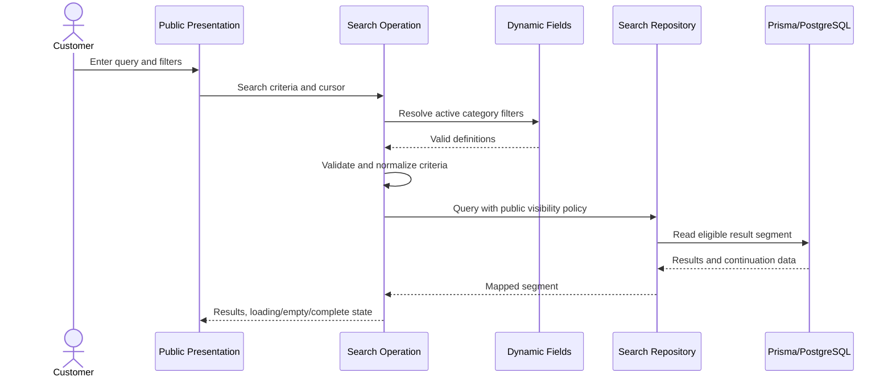
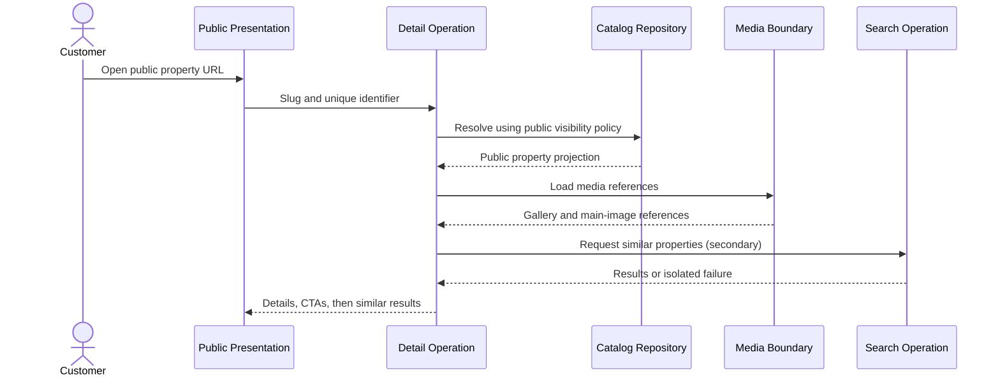
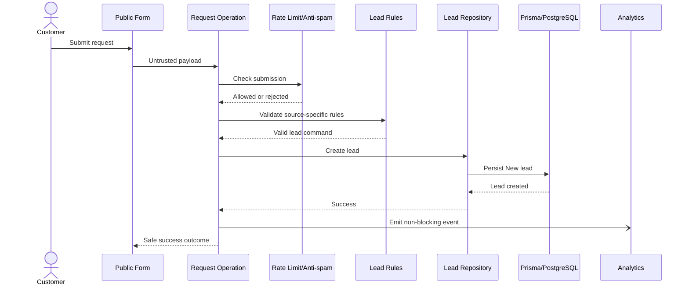
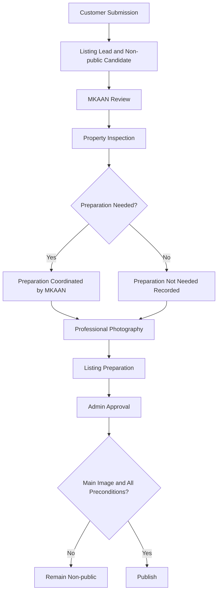
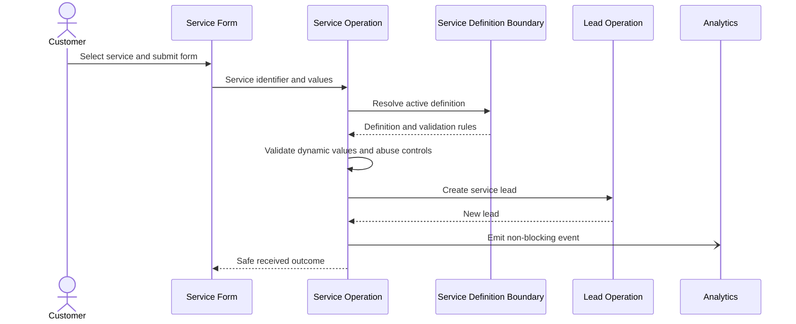
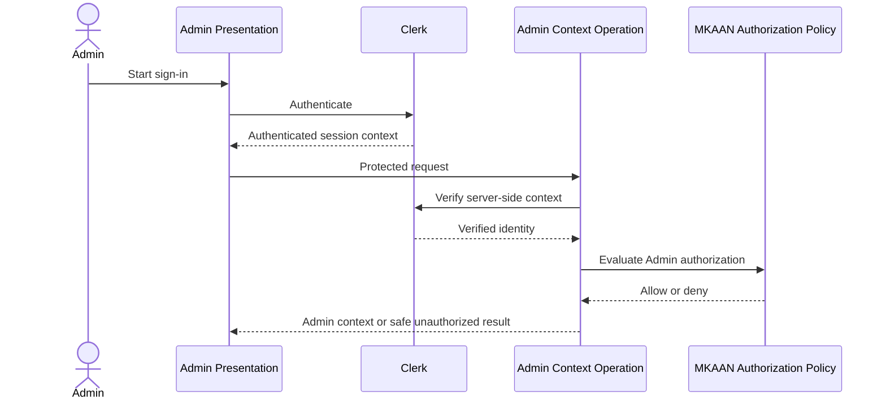
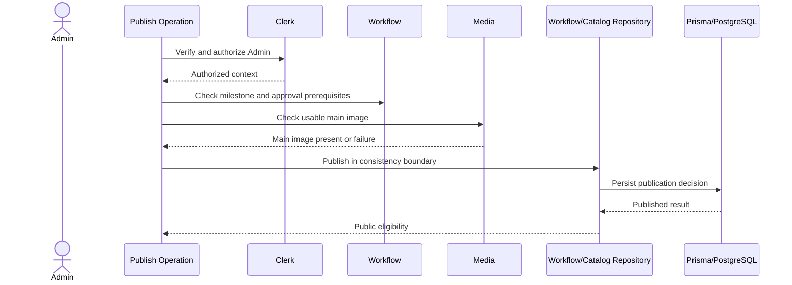
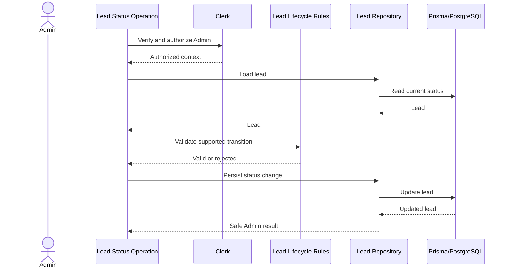
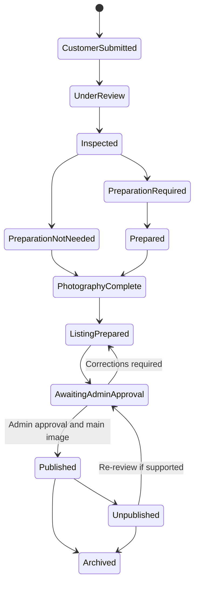
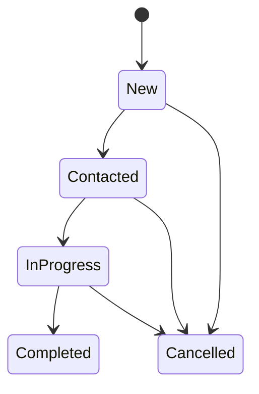

# MKAAN Software Design

**Project:** MKAAN  
**Document status:** MVP software design  
**Language:** Arabic-only MVP  
**Direction:** Right-to-left (RTL)  
**Last updated:** 2026-08-21

This document is a design specification only. It defines implementation boundaries, conceptual data, operations, rules, and flows. It does not define application source files, pages, UI components, Prisma schema, migrations, Server Actions, Route Handlers, production configuration, storage-provider implementation, or deployment configuration.

## 1. Design Scope and Authority

### 1.1 Purpose

The Software Design phase translates the approved product requirements, observable behavior, and modular-monolith architecture into implementation-ready technical and business boundaries. A later implementation phase should be able to use this document without inventing major architectural or business decisions.

### 1.2 Source documents

The design was derived from:

1. `docs/requirements/MKAAN-REQUIREMENTS.md`
2. `docs/requirements/MKAAN-SRS.md`
3. `docs/design/MKAAN-ARCHITECTURE.md`
4. The confirmed technology and authentication/database decisions supplied for this design phase.

### 1.3 Authority hierarchy

The authority order is:

1. Requirements
2. SRS
3. Architecture
4. This Software Design

The Requirements document remains authoritative for product scope, exclusions, business rules, and deferred decisions. The SRS is authoritative for observable behavior derived from those requirements. The Architecture is authoritative for the modular-monolith and layer boundaries.

The current phase explicitly confirms Clerk and PostgreSQL with Neon. Earlier documents described authentication and database providers as deferred because those decisions had not yet been supplied. This phase resolves those technical deferrals without changing the product scope. Image storage, analytics provider, hosting, monitoring, backups, and other listed deferrals remain unresolved.

### 1.4 Design boundaries

This design covers:

- Public and Admin boundaries within one Next.js App Router application.
- Application, domain, repository/data-access, and integration boundaries.
- Property, category, dynamic field, service, lead, workflow, media, SEO, and analytics concepts.
- Server-side operations, validation, authorization, consistency, security, and failure behavior.
- Conceptual PostgreSQL data design through Prisma without defining a schema.
- Traceability from requirements and SRS behavior to design responsibilities.

### 1.5 Explicit exclusions

This phase does not create or decide:

- Application pages, React components, or UI implementation.
- Prisma schema, database tables, migrations, or seed data.
- Server Actions, Route Handlers, API contracts, or concrete Next.js request mechanisms.
- Customer accounts, customer login, customer roles, customer profiles, or dashboards.
- Complex role systems, booking engines, payments, chat, favorites, or unrequested notifications.
- Image storage provider or image-processing provider.
- Analytics provider, hosting, monitoring, backup, or deployment provider.
- A testing framework or test files.
- Exact service-specific fields where the authoritative documents defer them.
- Exact publication state names and transition permissions where the authoritative documents defer them.

## 2. Technology Context

MKAAN is a full-stack Next.js 16 application using the App Router and a modular-monolith structure. Public and Admin experiences share one application boundary but have different access policies.

React 19, Tailwind CSS, shadcn/ui, and Lucide React belong to presentation. React Hook Form supports client form interaction and Zod supports structural input contracts. Neither is authoritative for business rules.

The server-side application boundary coordinates use cases and domain policies. Prisma is the only ORM/data-access boundary, PostgreSQL is the database technology, and Neon is the confirmed PostgreSQL provider. Presentation code never accesses Prisma directly.

Clerk is the confirmed authentication provider for Admin users. Clerk verifies identity and session context server-side. MKAAN authorization policy decides whether that authenticated identity may execute an Admin operation. Customers remain anonymous in the MVP.

Image storage and analytics are ports with replaceable adapters. No provider is selected for either concern.

## 3. System Design Overview

### 3.1 Overall structure

```text
Public Experience                    Admin Experience
        |                                    |
        +------------ Presentation ----------+
                         |
             Server-side Application Boundary
                         |
              Feature Application Operations
                         |
                    Domain Rules
                         |
              Repository/Data-access Ports
                         |
                       Prisma
                         |
                 PostgreSQL on Neon
                         |
            Replaceable Integration Adapters
        Clerk | Media Storage | Analytics | Operations
```

The concrete request mechanism is intentionally not selected. Any mechanism used later must enter the server-side application boundary before persistence, publication, lead creation, media acceptance, or protected administration.

### 3.2 Public boundary

The public boundary permits anonymous users to discover published properties, search and filter them, view published details, and submit property, viewing, listing, service, and contact requests. Public reads and public form operations must not expose unpublished data or require customer authentication.

### 3.3 Admin boundary

The Admin boundary is part of the same application. It is available only after Clerk authentication and server-side MKAAN authorization. It covers properties, categories, dynamic fields, locations, leads, services, and publication operations. UI visibility is never treated as authorization.

### 3.4 Server-side application boundary

Every state-changing operation enters this boundary. It performs request-context checks, structural validation, business validation, authorization where required, domain coordination, repository calls, and safe result mapping. It also isolates secondary analytics, media retrieval, and similar-property failures from primary operations.

### 3.5 Application layer

The application layer owns use-case orchestration. It does not own rendering or raw Prisma access. It coordinates domain policies, repositories, Clerk context, rate limiting/anti-spam ports, media ports, analytics ports, and safe error mapping.

### 3.6 Domain layer

The domain layer owns rules such as category applicability, dynamic-value validity, public visibility, publication prerequisites, lead-source assignment, supported lead statuses, and non-destructive handling. It is independent of React, Next.js, Clerk, Prisma, PostgreSQL, Neon, and external providers.

### 3.7 Data-access layer

Feature-owned repositories or data-access services encapsulate Prisma queries and map database records into application/domain data. Public visibility predicates are centralized or consistently reused. No presentation module, UI component, or domain policy constructs Prisma queries.

### 3.8 Integration boundaries

The design uses ports for:

- Clerk authentication and authenticated Admin context.
- Image storage and media retrieval.
- Analytics event delivery.
- Rate limiting and anti-spam enforcement.
- Error logging and monitoring.
- Backup, recovery, and safe migration operations.

Provider selection is deferred where listed in Section 30.

### 3.9 Shared cross-cutting responsibilities

Shared contracts may provide validation primitives, error classifications, safe public error mapping, authorization context, rate-limit decisions, analytics event contracts, SEO metadata contracts, media validation contracts, and incremental-loading contracts. Shared code must not become an unowned business-logic bucket.

## 4. Module Design

All modules expose application-level contracts and own their domain rules. Cross-module calls use explicit interfaces or application operations. A module may not bypass another module's business boundary by querying its data directly.

### 4.1 Property Catalog

**Responsibilities:** Own general property information, sale/rental transaction type, locations, categories as used by the catalog, public summaries, property detail source data, featured representation, and coordination of similar-property retrieval.

**Owned concepts:** Property, Location, catalog-facing Category reference, property summary/detail projections, public visibility query policy.

**Main use cases:** Read public property summaries, read a public property detail, manage property general information, manage locations, mark or order featured content where supported.

**Inputs:** Property identifiers, catalog search references, property general data, category reference, location reference, transaction type, price, description, and publication context.

**Outputs:** Public-safe summaries, public-safe detail data, Admin property results, location data, and category-aware property projections.

**Dependencies:** Categories and Dynamic Fields for applicability, Media for image references, Listing Workflow for publication policy, Search for similar-property retrieval, SEO for public metadata inputs, Prisma repositories.

**Allowed dependencies:** Domain policies, owned repositories, approved cross-module interfaces, shared validation/error contracts, and public visibility policy.

**Forbidden dependencies:** Direct presentation-to-Prisma access, direct storage-provider access, direct Clerk calls from domain rules, bypassing publication policy, and creating leads directly.

**Business rules:** Only approved and published properties are public. Price is validated server-side. Category-specific data is resolved through the dynamic-field boundary. Similar-property failure must not fail the primary detail.

**Data ownership:** Property general data, transaction type, location association, catalog ordering/featured attributes where applicable, and public read projections.

### 4.2 Categories and Dynamic Fields

**Responsibilities:** Define categories, dynamic field definitions, category-field applicability, options, display order, active state, required state, filterability, displayability, and server-side dynamic-value validation.

**Owned concepts:** Category, Dynamic Field Definition, category-field assignment, field option, property dynamic value contract.

**Main use cases:** Resolve fields for a category, validate property dynamic values, manage categories, manage fields, manage options and category applicability.

**Inputs:** Category reference, field definition data, active state, field type, flags, options, display order, and submitted dynamic values.

**Outputs:** Active category field definitions, validated normalized values, category-specific display metadata, and category-specific filter definitions.

**Dependencies:** Property Catalog for category context, Search for filter consumption, Admin Management for authorization, Prisma repositories.

**Allowed dependencies:** Shared structural validation and domain contracts. The module may be called by Property Catalog, Search, Services only through approved definition interfaces.

**Forbidden dependencies:** Accepting arbitrary field identifiers, treating UI-generated field lists as authoritative, direct public persistence, or silently accepting unrelated/inactive fields.

**Business rules:** Unknown field IDs, unrelated category fields, inactive fields, invalid types, invalid options, and missing required values are rejected server-side.

**Data ownership:** Field definitions, category applicability, options, and dynamic-value validation metadata. Property records own the association of accepted values to a property.

### 4.3 Property Search

**Responsibilities:** Search published properties, category, transaction, location, price, and dynamic filtering, sorting, incremental loading, loading states, empty states, and invalid-filter handling.

**Owned concepts:** Search criteria contract, dynamic filter criteria contract, sort contract, incremental result cursor contract, result segment contract.

**Main use cases:** Search, filter, sort, load the next result segment, resolve active category filters.

**Inputs:** Text query, category, sale/rental transaction type, location, price bounds, dynamic filters, sort selection, and continuation cursor.

**Outputs:** Validated active criteria, result segment, continuation information, category filter definitions, empty-result outcome, or safe failure.

**Dependencies:** Property Catalog, Categories and Dynamic Fields, Prisma repositories, shared public visibility policy, optional Analytics event boundary.

**Allowed dependencies:** Read-only catalog/search repositories and field-definition interfaces.

**Forbidden dependencies:** Returning unpublished records, applying inactive/unrelated dynamic filters, or creating business records.

**Business rules:** Every predicate is applied only to eligible public properties. Filters that become irrelevant after category changes are removed or excluded. Invalid filters are rejected or excluded, never treated as valid.

**Data ownership:** Search contracts and query orchestration. It does not own property records.

### 4.4 Property Details and CTA

**Responsibilities:** Retrieve public property details, general and category-specific data, price, location, description, media references, relevant CTA definitions, and similar properties.

**Owned concepts:** Public detail projection, CTA context, similar-property result boundary.

**Main use cases:** View a property, resolve applicable CTAs, retrieve similar properties as a secondary operation.

**Inputs:** Public property slug/identifier and optional context needed for CTA selection.

**Outputs:** Public detail, gallery references, CTA context before similar properties, and optional similar-property results.

**Dependencies:** Property Catalog, Media, Search, Customer Requests and Leads for CTA destinations, SEO, Analytics.

**Allowed dependencies:** Public read operations and explicit CTA contracts.

**Forbidden dependencies:** Exposing unpublished data, treating a viewing request as a booking, or making similar properties a prerequisite for detail success.

**Business rules:** Missing, invalid, unpublished, and archived properties produce unavailable/not-found behavior. CTA content is relevant to the property context. CTA output precedes similar properties.

**Data ownership:** Detail and CTA projections; source property data remains owned by Property Catalog.

### 4.5 Customer Requests and Leads

**Responsibilities:** Accept anonymous property, viewing, listing, and contact requests; assign lead source/type; create leads; manage supported lead statuses; and preserve business records non-destructively.

**Owned concepts:** Lead, lead source/type, request submission contracts, lead lifecycle, optional property/service associations, future optional customer identity reference.

**Main use cases:** Submit property request, submit viewing request, submit listing request, submit contact request, change lead status, read/manage leads.

**Inputs:** Public form payloads, selected property where applicable, selected service where applicable, anti-spam/rate-limit context, and Admin status-change input.

**Outputs:** Safe success result, lead identifier only where appropriate to the protected context, validation outcome, Admin lead view, or safe failure.

**Dependencies:** Property Catalog for public property checks, Services for service association, Listing Workflow for listing intake, Admin Management for authorization, Prisma repositories, Analytics.

**Allowed dependencies:** Lead creation interface, property-public-read interface, service-definition interface, and shared validation/security contracts.

**Forbidden dependencies:** Customer authentication in the MVP, automatic publication from listing intake, automatic viewing confirmation, permanent deletion by default, and storing unnecessary analytics personal data.

**Business rules:** Valid submissions create the corresponding lead. Invalid submissions do not. Viewing requests are not bookings. Supported statuses are New, Contacted, In Progress, Completed, and Cancelled.

**Data ownership:** Lead records, request-source classification, lifecycle status, non-destructive handling, and request associations.

### 4.6 Listing Workflow and Publication

**Responsibilities:** Coordinate listing intake, review, inspection, preparation if needed, professional photography, listing preparation, Admin approval, publish, unpublish, and archive operations.

**Owned concepts:** Listing workflow milestones, publication eligibility policy, publication command, unpublication/archive command, workflow completion evidence.

**Main use cases:** Create listing candidate from a request, record workflow progress, approve for publication, publish, unpublish, archive.

**Inputs:** Listing request context, property candidate, milestone completion information, Admin approval context, media readiness, and publication command.

**Outputs:** Non-public listing candidate, workflow status/progress projection, publication result, non-public result, or safe business-rule failure.

**Dependencies:** Property Catalog, Media, Customer Requests and Leads, Admin Management, SEO visibility policy, Prisma repositories.

**Allowed dependencies:** Explicit publication policy and media readiness interfaces.

**Forbidden dependencies:** Publication as a side effect of public listing submission, publication without Admin authorization/approval, bypassing main-image validation, or defining an unapproved booking/payment workflow.

**Business rules:** Required workflow order and Admin approval are mandatory. A published property must have a main image. Unpublishing and archiving remove public visibility and indexability.

**Data ownership:** Workflow milestone/progress data, publication decision data, and visibility state. Property general data remains owned by Property Catalog.

**Vocabulary constraint:** The conceptual stages are fixed by the SRS, but exact persisted status names and transition permissions remain deferred.

### 4.7 Services

**Responsibilities:** Provide the unified services entry point, resolve supported services, select active service form definitions, validate dynamic service data, and create service leads.

**Owned concepts:** Service definition, service field definition, service options, active form version/context, service selection contract.

**Main use cases:** List services, select a service, resolve its form, validate a service request, submit a service request.

**Inputs:** Service identifier and dynamic service-form values.

**Outputs:** Active service definition, form metadata, validated service payload, service lead association, or safe error.

**Dependencies:** Customer Requests and Leads, Admin Management, Prisma repositories, shared validation and abuse-protection contracts.

**Allowed dependencies:** Lead creation interface and service-definition repositories.

**Forbidden dependencies:** Accepting unsupported services, accepting values from another service, inventing fixed service fields in UI code, or exposing inactive definitions as active.

**Business rules:** MVP services are Finishing, Maintenance, and Prepare Your Property for Sale/Rent. The selected service controls the form and server-side validation. Exact service fields remain deferred.

**Data ownership:** Service definitions, active state, field definitions, options, display order, and form validation metadata.

### 4.8 Admin Management

**Responsibilities:** Provide protected Admin operation entry, Clerk-authenticated context handling, server-side authorization checks, and management operations for properties, categories, fields, locations, leads, services, and publication state.

**Owned concepts:** Admin request context, authorization decision, protected operation policy, Admin audit/context contract where needed.

**Main use cases:** Admin login, manage every confirmed resource, publish, unpublish, archive, and change lead status.

**Inputs:** Clerk authentication context and authorized Admin operation payload.

**Outputs:** Protected operation result, safe unauthorized result, safe validation result, or safe server failure.

**Dependencies:** Clerk adapter, all feature application operations, shared errors, Prisma only through feature repositories.

**Allowed dependencies:** Authentication verification, authorization policy, feature operation interfaces, and shared contracts.

**Forbidden dependencies:** Client-only authorization, additional customer roles, direct database mutation from presentation, or bypassing feature business rules.

**Business rules:** Every protected operation checks authentication and authorization server-side. The MVP does not define a multi-role system.

**Data ownership:** Authorization context and protected-operation coordination. Clerk remains the identity authority.

### 4.9 Media

**Responsibilities:** Validate uploaded files, maintain property media references, designate a main image, support galleries, and isolate media failures.

**Owned concepts:** Property media reference, media ordering, main-image designation, upload-validation result, storage-port contract.

**Main use cases:** Accept validated media, attach media to a property, set main image, remove/retire a media reference, retrieve gallery references.

**Inputs:** Validated file metadata/content, property reference, media reference, and main-image command.

**Outputs:** Non-Base64 media reference, gallery projection, main-image result, or isolated media failure.

**Dependencies:** Listing Workflow, Property Catalog, SEO social-image input, storage port, shared file-security validation.

**Allowed dependencies:** Storage abstraction and feature media repositories.

**Forbidden dependencies:** Direct provider calls from UI, Base64 persistence in PostgreSQL, accepting unvalidated uploads, or making one failed image invalidate an entire gallery.

**Business rules:** Multiple images are supported. Every published property must have a main image. Provider and storage architecture remain deferred.

**Data ownership:** Media references, property association, ordering, main-image marker, and media availability metadata.

### 4.10 SEO

**Responsibilities:** Resolve public property URLs, generate title/meta description inputs, canonical URL inputs, Open Graph data, social-image references, sitemap eligibility, robots behavior, and not-found behavior.

**Owned concepts:** Slug/unique-identifier presentation contract, public metadata projection, indexability policy, sitemap entry eligibility.

**Main use cases:** Resolve public property URL, produce property metadata, produce sitemap entries, produce robots behavior, handle unavailable property identifiers.

**Inputs:** Public published property projection, slug and unique identifier, target URL context, and optional meaningful category/location content policy.

**Outputs:** Arabic metadata, Latin/English slug URL, canonical URL, Open Graph metadata, social image reference, eligible sitemap entry, or not-found result.

**Dependencies:** Property Catalog, Listing Workflow public visibility policy, Media, deferred structured-data policy.

**Allowed dependencies:** Public read projections and explicit metadata contracts.

**Forbidden dependencies:** Indexing drafts/unpublished properties, generating unlimited indexable search/filter pages, or exposing internal property data.

**Business rules:** Only approved and published properties are publicly indexable. Customer-facing metadata is Arabic; Latin/English is allowed for URL slugs and identifiers. Exact structured-data types and meaningful-content rules remain deferred.

**Data ownership:** SEO projections and eligibility policy; property content remains owned by Property Catalog.

### 4.11 Analytics

**Responsibilities:** Define event contracts, accept events from feature modules, enforce privacy-minimized payloads, deliver through a replaceable provider boundary, and isolate delivery failure.

**Owned concepts:** Analytics event name, event envelope, privacy rules, delivery outcome.

**Main use cases:** Record property view, search, filter, request-started, CTA-click, and request-submitted events.

**Inputs:** Event name, non-sensitive contextual identifiers, and bounded metadata.

**Outputs:** Accepted/ignored delivery result; analytics failure never changes the core business result.

**Dependencies:** Feature event publishers and deferred analytics adapter.

**Allowed dependencies:** Shared event contracts and non-blocking delivery boundary.

**Forbidden dependencies:** Phone numbers, full request content, provider-specific logic in domain code, or making lead creation depend on analytics success.

**Business rules:** Analytics is secondary and non-blocking. Facebook Pixel and TikTok Pixel remain optional and unselected.

**Data ownership:** Event contract and delivery boundary, not customer business records.

## 5. Domain Model Design

### 5.1 Domain entity versus database model

A **domain entity** represents a business concept with identity, rules, relationships, and lifecycle. A **database model** is a persistence representation used by Prisma and PostgreSQL. A database model may normalize, split, or combine persistence data to support integrity and queries; it must not become the source of business rules. Repositories map database models into domain/application representations.

No Prisma model names, fields, enums, tables, or migrations are prescribed here.

### 5.2 Property

**Purpose:** Represents a real-estate property managed by MKAAN.

**Important attributes:** Stable identifier, Arabic title/content, Latin/English slug, unique URL identifier, transaction type for sale/rental, category, location, price, description, category-aware dynamic values, featured representation where applicable, media references, and publication/workflow context.

**Required/optional concepts:** Category, transaction type, location, price, and description are required concepts for a usable catalog record, subject to the detailed form rules. Dynamic values may be optional unless their active field definition is required. Media may be incomplete before publication but a main image is required for publication.

**Relationships:** Belongs to one category and one location in its catalog context; has zero or more dynamic values and media items; may be referenced by many viewing leads; may be associated with a listing lead; may be referenced by SEO projections.

**Cardinality:** Category-to-property and location-to-property are one-to-many. Property-to-media and property-to-dynamic-values are one-to-many. Property-to-leads is zero-to-many.

**Ownership:** Property Catalog owns general data. Dynamic Fields owns validation metadata. Media owns media references. Listing Workflow owns publication state and milestones.

**Invariants:** Price is server-validated. Category values are category-aware. Unpublished properties are not publicly readable. A published property has completed required workflow, Admin approval, and a main image.

**Lifecycle:** Candidate/listing intake, review, inspection, preparation if needed, photography, listing preparation, approval, published, unpublished, or archived. Exact persisted state vocabulary is deferred.

### 5.3 Category

**Purpose:** Classifies properties and determines applicable fields and filters.

**Important attributes:** Stable identifier, Arabic display data, active state, and ordering/management metadata where required.

**Required/optional concepts:** A category requires identity and active/inactive behavior. Its fields are supplied through category-field assignments.

**Relationships:** Has zero or more properties and zero or more applicable dynamic fields through an association.

**Cardinality:** One category has many properties and many field assignments; a field may be applicable to one or more categories only when explicitly assigned.

**Ownership:** Categories and Dynamic Fields owns definition and applicability. Property Catalog consumes it.

**Invariants:** Unrelated fields are not applicable automatically. Inactive definitions are excluded from active customer behavior.

**Lifecycle:** Defined, active, inactive, or managed/retired. Deactivation must not silently reinterpret existing values.

### 5.4 Location

**Purpose:** Represents a managed geographic reference used by properties, details, and filtering.

**Important attributes:** Stable identifier, Arabic display data, hierarchical or structured location information only as later approved, and active state.

**Required/optional concepts:** A property must reference a valid managed location for catalog publication. Exact target governorate/area and hierarchy remain deferred.

**Relationships:** One location may have many properties.

**Cardinality:** Location-to-property is one-to-many; a property has one catalog location in the MVP design.

**Ownership:** Property Catalog/Admin Management.

**Invariants:** Public location filters use valid managed locations only.

**Lifecycle:** Defined, active, inactive, and retained for existing historical records as appropriate.

### 5.5 Dynamic Field Definition

**Purpose:** Defines a category-aware property field and its validation/display/filter behavior.

**Important attributes:** Stable field identifier, label/content, field type, required flag, filterable flag, displayable flag, display order, active flag, and option definitions when applicable.

**Required/optional concepts:** Type and active state are required concepts. Required/filterable/displayable flags are explicit. Options are required only for option-based types.

**Relationships:** Applies to categories through an explicit association; has zero or more options; is referenced by property dynamic values.

**Cardinality:** Field-to-category is many-to-many through category applicability. Field-to-option is one-to-many where needed. Field-to-value is one-to-many.

**Ownership:** Categories and Dynamic Fields.

**Invariants:** Only active fields assigned to the selected category can be submitted, displayed, or used as filters. Required fields must have valid values.

**Lifecycle:** Draft/managed, active, inactive, and possibly retired. Exact administrative lifecycle vocabulary is not prescribed.

### 5.6 Property Dynamic Value

**Purpose:** Stores a validated value for a property-field definition.

**Important attributes:** Property reference, field reference, normalized value representation, and optional option reference/value according to the field type.

**Required/optional concepts:** Property and field association are required. Value presence depends on the definition's required flag.

**Relationships:** Belongs to one property and one field definition.

**Cardinality:** Property-to-values is one-to-many; a field can be used by many property values.

**Ownership:** Property Catalog owns the property association; Categories and Dynamic Fields owns interpretation and validation.

**Invariants:** No unknown, unrelated, inactive, invalid, or disallowed option value is persisted through a public or Admin operation.

**Lifecycle:** Created/updated with property data; excluded or retired when a definition becomes inactive rather than silently becoming valid.

### 5.7 Lead

**Purpose:** Represents a business record created from a valid customer request or contact action.

**Important attributes:** Stable identifier, source/type, supported status, submitted request data, contact data required by the approved form, optional property reference, optional service reference, timestamps, and non-destructive handling metadata.

**Required/optional concepts:** Source/type, status, request context, and creation time are required. Property association is required for viewing leads and optional for other sources. Service association is required for service leads. A listing lead may be associated with a property candidate after intake.

**Relationships:** May reference one property, one service, and one future optional customer identity reference. It may have status changes if history is retained.

**Cardinality:** A property may have many leads. A service may have many leads. A customer identity, if introduced later, may have many leads; it is absent for anonymous MVP submissions.

**Ownership:** Customer Requests and Leads.

**Invariants:** Invalid submissions create no lead. Supported statuses are New, Contacted, In Progress, Completed, and Cancelled. Leads are not normally permanently deleted. Viewing is not booking.

**Lifecycle:** New, Contacted, In Progress, Completed, or Cancelled. Exact transition permissions remain deferred, but the confirmed progression must be supported.

### 5.8 Service Definition and Service Form Field

**Purpose:** Defines one supported service and its active dynamic request form.

**Important attributes:** Stable service identifier, Arabic service name/content, active state, display order, field definitions, required flags, type, options, and field order.

**Required/optional concepts:** Service identity and active state are required. Field definitions and options are dynamic. Exact field lists and constraints are deferred.

**Relationships:** A service has zero or more fields and many service leads.

**Cardinality:** Service-to-fields is one-to-many; service-to-leads is one-to-many.

**Ownership:** Services.

**Invariants:** Only an active supported service and its active fields may be used. Values from another service are rejected.

**Lifecycle:** Defined, active, inactive, and retained for historical lead interpretation where appropriate.

### 5.9 Property Media Reference

**Purpose:** Represents a non-Base64 reference to stored property media.

**Important attributes:** Stable identifier, property reference, storage reference, ordering, main-image marker, alt-text/content reference, and availability/error metadata where needed.

**Required/optional concepts:** Property association and non-Base64 storage reference are required. Main-image marker is required for a published property, not necessarily for a pre-publication candidate.

**Relationships:** Belongs to one property.

**Cardinality:** Property-to-media is one-to-many; at most one media reference is the designated main image at a time.

**Ownership:** Media.

**Invariants:** Uploads are server-validated. Provider failure must not corrupt property data or make unrelated gallery items unusable.

**Lifecycle:** Pending/available/failed/retired as an implementation projection; exact media states are not a product status vocabulary.

### 5.10 Publication Workflow Context

**Purpose:** Captures whether the listing workflow has reached each conceptual prerequisite for publication.

**Important attributes:** Conceptual milestone completion for review, inspection, preparation decision, photography, listing preparation, Admin approval, and public visibility; timestamps or actor context may be retained where operationally required.

**Required/optional concepts:** Required workflow evidence and approval are required before publish. Preparation may be not needed, but that decision must be recorded as part of workflow completion.

**Relationships:** Associated with a property and, initially, its listing lead.

**Cardinality:** A property has one current workflow context; historical transitions may be retained if approved during implementation planning.

**Ownership:** Listing Workflow and Publication.

**Invariants:** Listing intake never publishes. Public visibility requires all required milestones, Admin approval, and a main image.

**Lifecycle:** Conceptual stages only. Exact database state values and transition permissions are deferred.

### 5.11 Optional future customer identity reference

**Purpose:** Provides an extension point for associating a future authenticated customer with leads without changing lead source or lifecycle design.

**Important attributes:** Nullable external identity reference, not a current customer account entity.

**Required/optional concepts:** Always absent or null in the MVP anonymous flow.

**Relationships:** A future identity may be associated with many leads; a lead has zero or one identity reference.

**Ownership:** Customer Requests and Leads owns the optional association; a future Customer Identity module would own identity details.

**Invariants:** No customer authentication, profile, or dashboard is introduced now. Anonymous lead creation remains valid.

## 6. Database Design

### 6.1 Persistence boundary

PostgreSQL on Neon is the system of record. Prisma is the only ORM/data-access layer. Repositories translate application operations into Prisma queries and map records back to domain/application objects. No Prisma schema or migration is created in this phase.

### 6.2 Conceptual models and ownership

| Conceptual persistence area | Owning module | Main relationships |
| --- | --- | --- |
| Property catalog record | Property Catalog | Category, Location, media, dynamic values, leads |
| Category and field definitions | Categories and Dynamic Fields | Categories, fields, options, property values |
| Property dynamic values | Property Catalog with field rules | Property and field definition |
| Location reference | Property Catalog/Admin | Properties |
| Workflow/publication context | Listing Workflow | Property, listing lead, media readiness |
| Lead record | Customer Requests and Leads | Optional property, optional service, optional future identity |
| Service definition/form | Services | Service fields, service leads |
| Property media references | Media | Property and storage reference |
| SEO projection/policy inputs | SEO | Published property and media |
| Analytics event boundary | Analytics | External event delivery, not required business persistence |

### 6.3 Relationships and cardinality

- One category has many properties.
- One location has many properties.
- One category has many explicitly assigned fields; one field may be assigned to many categories.
- One property has many dynamic values, with one value per property-field association for a single-valued field representation.
- One property has many media references and no more than one designated main image at a time.
- One property may be referenced by many viewing leads and other related leads.
- One service has many service fields and many service leads.
- One lead may optionally reference one property and one service, according to lead source.
- One future customer identity may optionally reference many leads; no identity records exist in the MVP scope.

### 6.4 Unique constraints

The implementation should enforce uniqueness for:

- Stable identifiers.
- Public property URL slug plus unique identifier combination.
- Category and field identifiers.
- Explicit category-field applicability pairs.
- Field options within their field definition where option identity is required.
- One property-field dynamic value association where the field is single-valued.
- Service identifiers and service-field applicability within a service.
- Storage reference where duplicate attachment would be invalid.

Exact database names and generated-key strategy remain implementation details, but uniqueness must be enforced at the data boundary rather than assumed from UI behavior.

### 6.5 Important indexes

Indexes should support these access patterns:

- Public property visibility combined with category, transaction type, location, and ordering.
- Public property price filtering.
- Public property slug/unique identifier resolution.
- Featured property ordering.
- Property dynamic values by field, normalized value, and property/category context.
- Lead status, source/type, related property/service, and creation time for Admin queues.
- Active category, field, applicability, filterability, and display order.
- Active service and service-field display order.
- Property media ordering and main-image lookup.

Indexes must be chosen from measured query patterns during implementation planning. They must not be used to bypass domain predicates.

### 6.6 Referential integrity

Foreign-key relationships should prevent orphaned property values, media references, category assignments, service fields, and lead associations. Deactivation or archival is preferred over deleting records needed by historical leads or published-content history.

When a referenced category, field, location, service, or media record becomes inactive, existing historical data must remain interpretable while new active operations reject it where the rules require rejection.

### 6.7 Nullable and optional relationships

- Lead-to-property is nullable for property requests, contact requests, and listing intake before a candidate is attached; required for viewing requests.
- Lead-to-service is nullable except for service leads.
- Lead-to-future-customer-identity is nullable for all MVP records.
- Property-to-main-image is nullable before publication and required by the publication operation.
- Dynamic field options are absent for non-option field types.
- Preparation completion evidence may represent “not needed” without adding a new business service.

### 6.8 Archive and unpublish

Unpublishing and archiving must change public eligibility without destructively deleting the property. Leads and historical associations remain available to authorized Admin operations. Archived/unpublished properties fail the public visibility predicate and are excluded from sitemap and public SEO reads.

### 6.9 Query-critical access patterns

The design must support:

1. Incremental public property search with validated criteria.
2. Public property detail by slug and unique identifier.
3. Category-aware field and filter definition retrieval.
4. Admin property/workflow queues.
5. Lead queue filtering and status changes.
6. Service form resolution by selected active service.
7. Main-image and gallery retrieval.
8. Published-property sitemap retrieval.

### 6.10 Public visibility predicate

Every public property listing, detail, similar-property, SEO, and sitemap query must apply one shared policy equivalent to:

```text
property is approved
AND property is published
AND property is not unpublished
AND property is not archived
```

The final representation of these conditions remains subject to the deferred publication vocabulary. A public repository must not accept a caller-provided flag that disables this policy.

## 7. Dynamic Fields Design

### 7.1 Definitions and applicability

Categories define which property fields apply. A field is active for a property operation only when its definition is active and an explicit category-field relationship exists. Applicability is not inferred from a label or from client-submitted data.

Each field definition includes:

- Stable field identifier.
- Field type discriminator.
- Required/optional flag.
- Filterable/non-filterable flag.
- Displayable/non-displayable flag.
- Options when applicable.
- Display order.
- Active/inactive state.

The exact field-type vocabulary and exact per-type constraints are not specified by the authoritative documents. Implementation planning must approve that vocabulary before building forms or persistence normalization.

### 7.2 Property values

Property dynamic values are submitted as a field identifier and value representation. The server first resolves the selected category and active definitions, then validates each submitted value against the resolved definition. Values are normalized before persistence so filtering and display use a stable representation.

### 7.3 Required validation

The dynamic-field validator must reject:

- Unknown field IDs.
- Field IDs not explicitly related to the selected category.
- Inactive fields.
- Missing values for active required fields.
- Values that do not match the field type.
- Values outside an option list.
- Duplicate or ambiguous values where the field contract permits only one value.

Optional fields may be omitted. An inactive field must not be silently accepted as a historical or hidden active field in a new operation.

### 7.4 Filtering and display

Only active filterable fields assigned to the selected category become public filters. Only active displayable fields assigned to the property category become customer-facing dynamic details. A field can be stored or used for internal behavior without being displayable.

### 7.5 Admin definition changes

Admin changes to definitions must not make existing persisted values invalid without an explicit handling policy. Deactivation removes a field from new active forms and filters. Existing values remain retained for historical interpretation unless an authorized data-maintenance decision is made.

## 8. Service Dynamic Forms

### 8.1 Service definition

The Services module owns the three confirmed MVP services:

1. Finishing
2. Maintenance
3. Prepare Your Property for Sale/Rent

Each service has an active definition and an associated dynamic form definition. A service field has the same conceptual controls needed for server validation: type, required state, active state, display order, and options where applicable.

### 8.2 Deferred exact fields

The authoritative documents do not define exact fields for any service or select the representative service example for UI demonstration. This design therefore defines the mechanism only and does not invent questions, pricing, scheduling, measurements, or operational fields.

### 8.3 Validation boundary

The server resolves the selected service, loads its active form definition, validates the submitted field identifiers and values, rejects missing required values and invalid options, and creates a service lead only after successful validation. A field from another service, unknown field, inactive field, or invalid value cannot be accepted.

### 8.4 Service-specific behavior

The selected service remains in the operation context and is stored with the resulting lead. The form contract changes by service definition. No service selection is treated as a booking, quote, payment, or guaranteed appointment.

## 9. Use Case Design

The following use cases describe behavior, not a choice between Server Actions, Route Handlers, or other Next.js mechanisms.

### 9.1 Public: Search properties

- **Actor:** Anonymous customer.
- **Preconditions:** Public search boundary is available.
- **Inputs:** Text query and optional valid category, transaction, location, price, dynamic filters, sort, and continuation cursor.
- **Validation:** Input shape, bounded query values, selected category, active filter definitions, and cursor validity.
- **Business rules:** Only approved/published/non-archived properties are eligible. Invalid criteria are rejected or excluded.
- **Main flow:** Resolve category definitions, normalize criteria, apply visibility policy, query a result segment, return continuation information.
- **Failure cases:** Invalid filter, invalid cursor, data-access failure, or empty result set.
- **Result:** Result segment, empty state, complete-result state, or safe search error.
- **Side effects:** Optional non-blocking search/filter analytics event.

### 9.2 Public: Filter properties

- **Actor:** Anonymous customer.
- **Preconditions:** Selected category, if any, is valid.
- **Inputs:** Category, transaction, location, price, and category-specific dynamic filter values.
- **Validation:** Values are checked against active definitions and category applicability.
- **Business rules:** Non-applicable filters are removed or excluded when category changes.
- **Main flow:** Resolve active filter definitions, validate values, combine with public visibility criteria, return results.
- **Failure cases:** Unknown category, unrelated field, inactive field, invalid option, or query failure.
- **Result:** Valid result criteria and result segment, or safe correction/error outcome.
- **Side effects:** Optional filter-applied analytics event without personal request data.

### 9.3 Public: Sort properties

- **Actor:** Anonymous customer.
- **Preconditions:** Search criteria are valid or normalized.
- **Inputs:** Supported sort selection and continuation cursor.
- **Validation:** Sort value is in the approved sort contract; cursor matches the sort context.
- **Business rules:** Sorting applies only to publicly eligible results.
- **Main flow:** Validate sort, query the next ordered result segment, return continuation state.
- **Failure cases:** Unsupported sort, invalid cursor, or query failure.
- **Result:** Ordered results or safe error.
- **Side effects:** Optional search analytics event.

### 9.4 Public: View property

- **Actor:** Anonymous customer.
- **Preconditions:** Property identifier has the approved public URL format.
- **Inputs:** Latin/English slug and unique identifier.
- **Validation:** Identifier shape and public visibility predicate.
- **Business rules:** Only published properties are exposed. Similar properties are secondary. CTA content appears before similar properties.
- **Main flow:** Resolve property, load public detail and media references, resolve CTA context, attempt similar properties separately, return detail.
- **Failure cases:** Invalid/missing/unpublished property, individual media failure, similar-property failure, primary data failure.
- **Result:** Public detail, safe not-found, or safe failure. Gallery and primary detail remain usable after secondary failure.
- **Side effects:** Optional property-view analytics event.

### 9.5 Public: Submit property request

- **Actor:** Anonymous customer.
- **Preconditions:** Public form is available; no account required.
- **Inputs:** Approved property-request form payload. Exact field list remains deferred.
- **Validation:** Structural schema, required values, form business rules, rate limit, and anti-spam checks.
- **Business rules:** Valid submission creates a property-request lead; invalid submission creates none.
- **Main flow:** Validate and protect submission, create a New lead, return a safe success result.
- **Failure cases:** Invalid input, abuse control rejection, persistence failure, or analytics failure.
- **Result:** Safe received/success outcome or safe failure. Analytics failure does not change success.
- **Side effects:** Lead creation and optional non-blocking analytics event.

### 9.6 Public: Submit viewing request

- **Actor:** Anonymous customer.
- **Preconditions:** Referenced property is public and published.
- **Inputs:** Property identifier and approved viewing form payload.
- **Validation:** Identifier, public visibility, required form values, rate limit, and anti-spam.
- **Business rules:** Creates a viewing lead but never a confirmed booking. MKAAN must confirm separately.
- **Main flow:** Validate public property and form, create New viewing lead, return a received-request outcome.
- **Failure cases:** Missing/unpublished property, invalid input, abuse control rejection, or persistence failure.
- **Result:** Safe received outcome, not-found, validation error, or safe failure.
- **Side effects:** Lead creation and optional viewing-started/submitted analytics events.

### 9.7 Public: Submit listing request

- **Actor:** Anonymous customer.
- **Preconditions:** Listing request form is available; no account required.
- **Inputs:** Approved listing form payload. Exact field list remains deferred.
- **Validation:** Structural schema, required values, safe upload validation if uploads are later supported, rate limit, and anti-spam.
- **Business rules:** Creates a listing lead and non-public candidate/workflow intake. It never publishes automatically.
- **Main flow:** Validate, create listing lead, create or associate non-public listing candidate, return safe received outcome.
- **Failure cases:** Invalid input, unsafe upload, abuse rejection, or persistence failure.
- **Result:** Non-public listing intake result or safe failure.
- **Side effects:** Lead/candidate creation and optional listing-request analytics.

### 9.8 Public: Submit contact request

- **Actor:** Anonymous customer.
- **Preconditions:** Contact flow is available.
- **Inputs:** Approved contact form payload. Exact field list remains deferred.
- **Validation:** Structural and business validation, rate limit, anti-spam.
- **Business rules:** Valid submission creates a contact lead.
- **Main flow:** Validate, create New contact lead, return safe success.
- **Failure cases:** Invalid input, abuse rejection, persistence failure, or analytics failure.
- **Result:** Safe received outcome or safe failure.
- **Side effects:** Lead creation and optional contact analytics.

### 9.9 Public: Submit service request

- **Actor:** Anonymous customer.
- **Preconditions:** Selected service is active and supported.
- **Inputs:** Service identifier and dynamic service-form payload.
- **Validation:** Active service definition, active field definitions, required values, valid types/options, rate limit, and anti-spam.
- **Business rules:** Form behavior is service-specific; valid submission creates a service lead.
- **Main flow:** Resolve service, validate dynamic form, create New service lead, return success.
- **Failure cases:** Unsupported/inactive service, unknown field, invalid value, missing required value, abuse rejection, or persistence failure.
- **Result:** Safe received outcome or safe correction/failure.
- **Side effects:** Lead creation and optional service-request analytics.

### 9.10 Admin: Admin login

- **Actor:** Admin candidate.
- **Preconditions:** Clerk authentication boundary is available.
- **Inputs:** Clerk-managed authentication interaction and resulting server-side context.
- **Validation:** Clerk verifies authentication. MKAAN verifies Admin authorization before protected access.
- **Business rules:** Authentication alone is not sufficient if the identity is not authorized for MKAAN Admin operations.
- **Main flow:** Authenticate with Clerk, establish server-side context, evaluate Admin policy, allow or deny protected access.
- **Failure cases:** Unauthenticated, invalid Clerk context, or authenticated but unauthorized identity.
- **Result:** Protected Admin context or safe unauthorized outcome.
- **Side effects:** Security diagnostics may be logged without exposing secrets.

### 9.11 Admin: Manage properties

- **Actor:** Authorized Admin.
- **Preconditions:** Clerk-authenticated and server-authorized context.
- **Inputs:** Property create/update/read/archive data and dynamic values.
- **Validation:** Structural data, price, category, location, active dynamic-field definitions, media references, and workflow constraints.
- **Business rules:** Property data remains category-aware; Admin mutation cannot bypass publication policy.
- **Main flow:** Authorize, validate, apply domain rules, persist through repository, return Admin projection.
- **Failure cases:** Unauthorized, invalid field/category, invalid price, missing reference, or persistence failure.
- **Result:** Updated property or safe failure.
- **Side effects:** Property change and optional internal analytics/audit event.

### 9.12 Admin: Manage categories

- **Actor:** Authorized Admin.
- **Preconditions:** Authorized Admin context.
- **Inputs:** Category definition and active/order changes.
- **Validation:** Structural values and uniqueness.
- **Business rules:** Deactivation must not silently invalidate historical property data.
- **Main flow:** Authorize, validate, persist category definition, return result.
- **Failure cases:** Unauthorized, duplicate/invalid category, conflicting active data, or persistence failure.
- **Result:** Updated category or safe failure.
- **Side effects:** Category definition change.

### 9.13 Admin: Manage dynamic fields

- **Actor:** Authorized Admin.
- **Preconditions:** Authorized Admin context.
- **Inputs:** Field type, flags, options, category assignments, active state, and order.
- **Validation:** Structural definition, option compatibility, uniqueness, and protected active-data rules.
- **Business rules:** A field cannot become active for a category without explicit applicability. Deactivation excludes it from new forms/filters.
- **Main flow:** Authorize, validate definition, update applicability/metadata, return result.
- **Failure cases:** Invalid definition, incompatible options, unauthorized mutation, or persistence failure.
- **Result:** Updated field definition or safe failure.
- **Side effects:** Future property validation/filter behavior changes.

### 9.14 Admin: Manage locations

- **Actor:** Authorized Admin.
- **Preconditions:** Authorized Admin context.
- **Inputs:** Location data and active state.
- **Validation:** Structural data, uniqueness, and reference safety.
- **Business rules:** Existing historical properties retain interpretable location references.
- **Main flow:** Authorize, validate, persist, return result.
- **Failure cases:** Unauthorized, invalid/duplicate location, or persistence failure.
- **Result:** Updated location or safe failure.
- **Side effects:** Public filter/detail options may change when active state changes.

### 9.15 Admin: Manage leads

- **Actor:** Authorized Admin.
- **Preconditions:** Authorized Admin context and existing lead.
- **Inputs:** Lead filters, lead detail request, supported status change, and non-destructive handling command.
- **Validation:** Lead identifier, allowed status vocabulary, transition policy, and concurrency/version context where needed.
- **Business rules:** Supported statuses only; leads are not normally permanently deleted.
- **Main flow:** Authorize, load lead, validate status transition, persist through repository, return result.
- **Failure cases:** Unauthorized, missing lead, unsupported status, invalid transition, conflict, or persistence failure.
- **Result:** Updated lead or safe failure.
- **Side effects:** Status change and optional internal diagnostic/audit event.

### 9.16 Admin: Manage services

- **Actor:** Authorized Admin.
- **Preconditions:** Authorized Admin context.
- **Inputs:** Service definition, active state, field definitions, options, and order.
- **Validation:** Structural definition, active-service rules, field applicability, and option compatibility.
- **Business rules:** Only the three confirmed services are in MVP scope unless requirements change.
- **Main flow:** Authorize, validate, persist definition, return result.
- **Failure cases:** Unauthorized, unsupported service, invalid field definition, or persistence failure.
- **Result:** Updated service definition or safe failure.
- **Side effects:** Future public service form behavior changes.

### 9.17 Admin: Publish property

- **Actor:** Authorized Admin with publication permission under the eventual Admin policy.
- **Preconditions:** Property exists; workflow prerequisites are complete; property has a main image.
- **Inputs:** Property identifier and approval/publication command.
- **Validation:** Authentication, authorization, workflow completion, professional photography prerequisite, main-image existence, public-data validity, and publication state.
- **Business rules:** Listing intake never publishes. Admin approval is mandatory. Public visibility begins only after successful publication consistency checks.
- **Main flow:** Authorize, load property/workflow/media, validate prerequisites, atomically apply publication decision, return public-eligibility result.
- **Failure cases:** Unauthorized, missing property, incomplete workflow, missing main image, invalid property, or persistence conflict.
- **Result:** Published property or safe business-rule failure.
- **Side effects:** Public listing/detail/SEO eligibility changes.

### 9.18 Admin: Unpublish property

- **Actor:** Authorized Admin.
- **Preconditions:** Authorized Admin context and existing property.
- **Inputs:** Property identifier and unpublish command.
- **Validation:** Authorization, identifier, current state, and concurrency context where needed.
- **Business rules:** Property becomes non-public and non-indexable without destructive deletion.
- **Main flow:** Authorize, load, apply unpublish policy, persist, return non-public result.
- **Failure cases:** Unauthorized, missing property, invalid command, conflict, or persistence failure.
- **Result:** Non-public property result or safe failure.
- **Side effects:** Removed from public search, detail, and sitemap eligibility.

### 9.19 Admin: Archive property

- **Actor:** Authorized Admin.
- **Preconditions:** Authorized Admin context and existing property.
- **Inputs:** Property identifier and archive command.
- **Validation:** Authorization, identifier, and archive policy.
- **Business rules:** Archive is non-destructive and removes public visibility/indexability.
- **Main flow:** Authorize, apply archive policy, persist, return result.
- **Failure cases:** Unauthorized, missing property, invalid state, conflict, or persistence failure.
- **Result:** Archived non-public property or safe failure.
- **Side effects:** Public content removal while historical records remain managed.

## 10. Application Operation Design

The operation contracts below are conceptual. They do not choose Server Actions, Route Handlers, API endpoints, or page-level invocation mechanisms.

| Operation | Purpose and input contract | Output contract | Validation and authorization | Data/integration dependencies | Consistency |
| --- | --- | --- | --- | --- | --- |
| SearchPublishedProperties | Search criteria, sort, continuation cursor | Result segment and continuation state | Search shape, category-aware filters; public | Search/catalog repositories, analytics | Read consistency sufficient for a result segment |
| GetPublishedPropertyDetail | Slug and unique identifier | Public detail and optional secondary data | Identifier and visibility predicate; public | Catalog, media, search, SEO | Primary detail independent of similar-property failure |
| ResolveCategoryFields | Category identifier | Active field/filter/display definitions | Active category; public or Admin by context | Dynamic-field repository | Read consistency |
| SubmitPropertyRequest | Approved property-request payload and abuse context | Safe received result | Zod shape plus business/form/rate-limit checks; public | Leads repository, analytics | Lead creation atomic |
| SubmitViewingRequest | Public property identifier, viewing payload | Safe received result | Public property check plus form/abuse checks; public | Catalog, leads, analytics | Property validation and lead creation atomic |
| SubmitListingRequest | Listing payload and optional media context | Non-public intake result | Form, upload, and abuse checks; public | Leads, workflow, media boundary, analytics | Lead and non-public intake atomic |
| SubmitContactRequest | Contact payload and abuse context | Safe received result | Form and abuse checks; public | Leads, analytics | Lead creation atomic |
| ResolveServiceForm | Service identifier | Active service/form definition | Supported active service; public or Admin | Services repository | Read consistency |
| SubmitServiceRequest | Service identifier, dynamic payload, abuse context | Safe received result | Service-aware dynamic validation; public | Services, leads, analytics | Service association and lead creation atomic |
| GetAdminContext | Clerk server context | Authenticated/authorized Admin context | Clerk verification and MKAAN Admin policy | Clerk adapter | Request-scoped consistency |
| ManageProperty | Property data and command | Admin property projection | Admin authorization, category/field/price/media rules | Catalog, fields, media, workflow repositories | Property update atomic with dependent values |
| ManageCategory | Category command | Admin category projection | Admin authorization and uniqueness | Category repository | Definition update atomic |
| ManageDynamicField | Field/options/applicability command | Admin field projection | Admin authorization and definition rules | Dynamic-field repository | Definition and applicability update atomic |
| ManageLocation | Location command | Admin location projection | Admin authorization and reference rules | Location repository | Definition update atomic |
| ManageLead | Lead query or status command | Admin lead projection | Admin authorization and lifecycle rules | Lead repository | Status change atomic |
| ManageService | Service/form definition command | Admin service projection | Admin authorization and service rules | Service repository | Definition update atomic |
| PublishProperty | Property and approval command | Published/non-published result | Admin auth, workflow, media, visibility rules | Workflow, catalog, media repositories | Publication transaction required |
| UnpublishProperty | Property command | Non-public property result | Admin authorization and state rules | Workflow/catalog repositories | Visibility change atomic |
| ArchiveProperty | Property command | Archived property result | Admin authorization and archive rules | Workflow/catalog repositories | Visibility change atomic |
| AttachPropertyMedia | Property/media command | Media reference result | Admin authorization and upload validation | Media repository, storage port | Reference persistence atomic; storage failure isolated |
| ResolvePropertySEO | Public property URL/context | Metadata projection or not-found | Published visibility policy | Catalog, media, SEO policy | Read consistency |
| GetSitemapEntries | Sitemap request context | Eligible public entries | Published/approved predicate | SEO/catalog repository | Read consistency |
| EmitAnalyticsEvent | Event envelope | Delivery accepted/failed outcome | Payload privacy contract | Deferred analytics adapter | Never part of core transaction success |

Every operation returns a typed application outcome that distinguishes success, validation failure, authorization failure, not-found, business-rule failure, and infrastructure failure. Presentation maps those outcomes to user-visible states.

## 11. Validation Design

Validation is layered. A successful client-side parse is never sufficient to trust input.

### 11.1 Input shape level

Zod schemas conceptually validate object shape, primitive types, required structural fields, bounded lengths, identifier formats, and safe collection sizes. These schemas are shared as contracts where appropriate, but server-side parsing is mandatory.

### 11.2 Business-rule level

Domain policies validate relationships and state: public property eligibility, sale/rental rules, price validity, lead source, supported statuses, publication prerequisites, non-destructive handling, and viewing-not-booking behavior.

### 11.3 Dynamic field level

Resolve category and active definitions before validating values. Reject unknown, unrelated, inactive, missing-required, invalid-type, and invalid-option values. Validate both Admin and public input.

### 11.4 Service form level

Resolve the selected active service definition before accepting values. Validate field identifiers, active status, type, required values, and options. Exact service fields and detailed constraints remain deferred.

### 11.5 Search/filter level

Validate category, transaction, location, price bounds, dynamic filters, sort, and continuation cursor against active definitions and public visibility rules. Exclude or reject filters invalidated by category changes.

### 11.6 Publication level

Validate Admin authorization, workflow completion, inspection/preparation/photography/listing-preparation evidence, Admin approval, valid property data, and main-image existence. Publication is not inferred from listing intake.

### 11.7 Lead level

Validate source-specific associations: viewing requires a currently public property; service requests require a selected active service; invalid public forms create no lead. Lead status changes accept only the confirmed vocabulary and permitted transition policy.

### 11.8 Media level

Validate file metadata and content server-side, reject unsafe or unsupported files, avoid Base64 database storage, and verify storage references before accepting media as usable. Exact format/size/provider rules remain deferred.

### 11.9 Admin operation level

Every protected operation validates Clerk context, MKAAN Admin authorization, operation-specific input, domain state, and concurrency/conflict conditions where applicable. Hidden controls do not replace these checks.

## 12. Authentication and Authorization Design

### 12.1 Admin authentication

Clerk authenticates Admin users. The server obtains and verifies the authenticated Clerk context before entering protected application operations. The application must not trust client-provided identity claims.

### 12.2 Admin authorization

MKAAN applies an Admin authorization policy to the verified Clerk identity before every protected read or mutation. The policy must provide a clear allow/deny decision to the application layer. The exact Admin membership/allowlist configuration and detailed authorization model remain deferred under the authoritative `DEFER-009`; no multi-role model is introduced.

### 12.3 Protected operations

Admin dashboard access, property/category/field/location/lead/service management, publication, unpublication, and archiving are protected. Authorization occurs inside the server-side application boundary and again at the operation boundary as needed.

### 12.4 Public operations

Published property reads, search, SEO reads, and all customer forms are public and do not require customer authentication. Public forms use server validation, rate limiting, anti-spam, safe input handling, and public visibility checks instead of customer identity.

### 12.5 Unauthorized behavior

- Unauthenticated protected access returns a safe authentication-required outcome.
- Authenticated but unauthorized access returns a safe forbidden outcome.
- Public access to unpublished/missing content returns not-found or unavailable behavior without disclosure.
- No stack traces, provider claims, database details, or secrets are exposed.

### 12.6 Future customer identity

The Lead domain includes an optional nullable external identity reference concept. It is absent for all MVP anonymous submissions. A future customer-authentication phase may populate that reference and introduce a separate identity module without changing lead sources, status lifecycle, or anonymous creation behavior.

## 13. Lead Design

### 13.1 Lead concept and sources

Every valid customer request that requires follow-up creates a business Lead. Confirmed sources/types are:

- Viewing request.
- Property request.
- Listing request.
- Service request.
- Contact request.

### 13.2 Lead data

A lead contains its source/type, supported status, request payload appropriate to that source, required contact data from the approved form, creation/update timestamps, and optional related property/service references. Exact public form field lists remain deferred and must not be invented here.

### 13.3 Relationships

- Viewing leads require one public property at submission time.
- Property requests may have no selected property.
- Listing leads may initially have no property and may later associate with a non-public candidate.
- Service leads require one selected service.
- Contact leads may have no property or service.
- Future customer identity is optional and nullable.

### 13.4 Lifecycle and statuses

Confirmed statuses are:

- **New:** Received and not yet handled.
- **Contacted:** MKAAN contacted or attempted contact.
- **In Progress:** MKAAN is actively handling it.
- **Completed:** Requested business handling is complete.
- **Cancelled:** It will not continue.

The supported progression is New to Contacted to In Progress to Completed, with Cancelled available when applicable. Exact transition permissions are deferred and must be decided before implementation of the Admin transition matrix.

### 13.5 Non-destructive handling

Leads should not normally be permanently deleted. Cancellation, archival, or another approved non-destructive handling path is preferred. Historical lead associations must remain safe and interpretable.

### 13.6 Anonymous submission

No customer session, account, registration, profile, or dashboard is required. Rate limiting and anti-spam protect public intake.

### 13.7 Viewing requests are not bookings

A viewing lead records a request for MKAAN to arrange a viewing. It is not a booking, time-slot reservation, confirmation, or booking-engine state.

## 14. Listing Workflow and Publication Design

### 14.1 Required workflow

```text
Customer Submission
  -> MKAAN Review
  -> Property Inspection
  -> Preparation if Needed
  -> Professional Photography
  -> Listing Preparation
  -> Admin Approval
  -> Publish
```

### 14.2 Conceptual states

The design uses these conceptual states/conditions without prescribing final database values:

- Customer submitted.
- Under MKAAN review.
- Inspected.
- Preparation required or preparation not needed.
- Prepared where required.
- Professional photography complete.
- Listing preparation complete.
- Awaiting Admin approval.
- Approved and published.
- Unpublished.
- Archived.

The exact status names, persisted representation, transition permissions, and operational evidence format remain deferred.

### 14.3 Preconditions and actors

- Customer: submits a listing request; cannot publish.
- MKAAN operational users: review, inspect, coordinate preparation, photograph, and prepare the listing. The exact internal actor model is not expanded into customer/Admin roles.
- Authorized Admin: approves publication and executes publish/unpublish/archive operations according to the eventual Admin policy.
- Media boundary: confirms a usable main-image reference.

Publication requires required workflow completion, professional photography completion, Admin approval, valid property data, and a main image.

### 14.4 Public visibility

All pre-publication, unpublished, and archived states are non-public and non-indexable. Public listing, detail, similar-property, SEO, sitemap, and robots behavior must reuse the same visibility policy.

### 14.5 Unpublish and archive

Unpublish removes public visibility while retaining the property and leads. Archive is also non-destructive and removes public visibility/indexability. Neither operation automatically deletes business records.

## 15. Search and Filtering Design

### 15.1 Criteria

Search supports text, category, sale/rental transaction type, location, price bounds, active category-specific dynamic filters, sorting, and incremental loading.

### 15.2 Category-aware filtering

The selected category determines active dynamic filter definitions. When the category changes, still-applicable filters may remain. Filters no longer applicable are removed or excluded before querying. The server repeats this validation even if the client has already adjusted the UI.

### 15.3 Sorting and incremental loading

The result contract returns an ordered segment plus continuation information. The continuation value must be bound to the validated criteria and sort context so that subsequent requests cannot skip the visibility policy or change ordering unexpectedly. Page size and cursor encoding remain implementation decisions.

This is incremental loading, not a requirement to expose a numbered pagination UI.

### 15.4 Featured ordering

Featured properties may receive an approved ordering preference within the public result policy. The authoritative documents require support for featured properties but do not define ranking logic. Ranking must therefore be isolated behind a catalog/search policy and not assumed beyond the eventual approved rule.

### 15.5 Efficiency

Repositories should select only the data needed for the listing projection, apply visibility before other predicates, use indexes for high-frequency filters, and avoid loading full galleries for search cards. Dynamic filter queries must use normalized values and active field definitions.

### 15.6 Invalid and empty results

Invalid criteria are rejected or excluded safely. No-match valid criteria produce an empty state, not an error. There is a distinct loading state while another segment is requested and a complete state when no continuation remains.

## 16. Media Design

### 16.1 Property media

Properties support multiple media references, a gallery, and one designated main image. The public detail projection uses references, not embedded Base64 content.

### 16.2 Storage boundary

The Media module calls an image-storage port that accepts validated content and returns a non-Base64 reference. The provider, object layout, CDN, processing technology, and retention policy are deferred.

### 16.3 Upload validation

Server-side validation must inspect the upload independently of client metadata, reject unsafe/unsupported content, enforce approved limits once decided, prevent executable content from being treated as an image, and avoid trusting a caller-provided storage reference. Secrets and provider credentials remain outside application input.

### 16.4 Publication prerequisite

The publication operation must verify that at least one usable media reference is designated as the main image. A listing request or customer-supplied preliminary image does not automatically satisfy the professional-photography business prerequisite.

### 16.5 Failure isolation

One failed media retrieval produces a media-level fallback/error state and does not make unrelated gallery items unusable. A media failure must not unnecessarily block the core property detail experience. Storage failure must not create an invalid media record.

## 17. SEO Design

### 17.1 Property URL

Public property URLs use a Latin/English slug plus a unique identifier, consistent with the approved example pattern `/properties/apartment-for-sale-shebin-el-kom-a8f32`. Customer-facing property content remains Arabic.

### 17.2 Metadata

Eligible property pages provide dynamic Arabic title and meta description, canonical URL, Open Graph metadata, and a social-sharing image reference. Structured data is supported through an explicit SEO boundary, but exact structured-data types remain deferred.

### 17.3 Indexability

Only approved and published properties are eligible for public indexing. Draft, pre-publication, unpublished, and archived properties are excluded from the sitemap and must not be indexable.

Search/filter combinations must not automatically generate unlimited indexable pages. Location/category pages may be indexable only when they meet a future meaningful-content policy. The target geography remains deferred.

### 17.4 Site behavior

The site provides sitemap behavior, robots.txt behavior, and proper 404 handling. Public requests for missing or unpublished properties return safe not-found/unavailable behavior.

### 17.5 Canonical and exposure policy

Canonical URLs are generated only from eligible public content. Alternate or malformed identifiers must not expose arbitrary records. SEO reads use the same public visibility predicate as property details.

## 18. Analytics Design

### 18.1 Event contracts

The analytics boundary supports:

- Property view.
- Search.
- Filter applied.
- Viewing request started.
- Viewing request submitted.
- Property request submitted.
- Listing request submitted.
- Service request submitted.
- Contact submitted.
- CTA click.

Important conversions are viewing requests, property requests, listing requests, and service requests.

### 18.2 Ownership

Feature modules own when a business event is meaningful. Analytics owns the event envelope, privacy filtering, delivery boundary, and failure isolation. Domain operations must not depend on a provider.

### 18.3 Payload principles

Events may contain bounded event-specific context such as public property/service/category identifiers and non-sensitive interaction metadata. They must not contain unnecessary phone numbers, full request content, secrets, or unrestricted customer data.

### 18.4 Delivery

Delivery is non-blocking and secondary. Analytics failure must not prevent a valid form submission, lead creation, success result, or primary page operation. Provider selection, queueing, retry technology, and Facebook/TikTok implementation remain deferred.

## 19. Error Handling Design

### 19.1 Error classes

- **Validation error:** Input shape or field value is invalid.
- **Authentication error:** Protected operation has no valid Clerk-authenticated context.
- **Authorization error:** Identity is authenticated but not authorized for the Admin operation.
- **Not found:** Resource is missing, invalidly identified, unpublished, or archived in a public context.
- **Business-rule failure:** Input is structurally valid but violates category, lifecycle, publication, media, lead, or service rules.
- **Database failure:** Persistence or query operation failed.
- **External integration failure:** Clerk, media, analytics, rate-limit, logging, or other adapter failed.

### 19.2 Public mapping

Public responses expose safe, actionable validation/correction, unavailable, or generic failure outcomes. Empty results are not errors. Similar-property and individual-media failures are isolated. Analytics failure is not surfaced as a failed lead submission.

### 19.3 Admin mapping

Admin users receive safe operation-specific outcomes for validation, authorization, not-found, conflict, and infrastructure failures. Diagnostic identifiers may be used only if they do not reveal secrets or internal details.

### 19.4 Never expose

The application never exposes stack traces, Prisma/database internals, SQL, provider credentials, Clerk secrets/tokens, environment values, or raw internal exception messages.

### 19.5 Diagnostics

Internal diagnostics belong behind the deferred logging/monitoring boundary. Correlation information may be retained internally without becoming part of a public error contract.

## 20. Data Access Design

### 20.1 Repository ownership

Each feature owns repositories or data-access services for its persistence concerns. A repository exposes domain/application-shaped operations, not arbitrary Prisma client access.

Examples include catalog repository, dynamic-field repository, search repository, lead repository, workflow repository, service repository, media-reference repository, and SEO read repository.

### 20.2 Prisma isolation

Prisma is initialized and used only inside server-side data-access infrastructure. Application operations call repository contracts. Domain policies receive data or ports and never import Prisma.

### 20.3 Query construction

Repositories construct parameterized Prisma queries from validated criteria. They apply field applicability and public visibility predicates centrally. Caller-supplied “include unpublished” behavior is not available to public repository methods.

### 20.4 Mapping

Database records are mapped to domain entities or purpose-specific projections. Search cards, property details, Admin lists, SEO metadata, and lead queues should not all load the same unrestricted record shape.

### 20.5 Transaction boundaries

Transactions are selected at application-operation boundaries when multiple writes must succeed together. Lead creation, publication, dynamic value updates, and status changes are considered consistency boundaries in Section 24.

### 20.6 Flow

```text
Presentation input
  -> Application operation
  -> Structural/business validation
  -> Domain policy
  -> Feature repository contract
  -> Prisma query/transaction
  -> PostgreSQL on Neon
  -> Mapping
  -> Safe application outcome
```

Presentation must never access Prisma directly.

## 21. Dependency Rules

### 21.1 Rules

1. Presentation calls application operations only.
2. Presentation never imports Prisma or storage/analytics providers.
3. Application operations coordinate domain policies, repositories, and ports.
4. Domain rules depend on neither presentation nor infrastructure.
5. Public property reads always use the shared publication policy.
6. Request flows create leads through the Leads boundary.
7. Listing intake cannot call publication as a side effect.
8. Media is accessed through the Media boundary.
9. Analytics is invoked non-blockingly.
10. Admin authorization runs before protected operations.
11. Feature modules use approved cross-module interfaces, not another module's tables.
12. No circular business dependency is allowed.

### 21.2 Dependency matrix

| Module | Allowed dependencies | Forbidden dependencies |
| --- | --- | --- |
| Property Catalog | Dynamic Fields, Media, Listing Workflow policy, Search read contract, repositories | Direct UI/Prisma, direct provider calls, direct lead creation |
| Categories/Dynamic Fields | Property category context, Search filter contract, repositories | UI authority, unrelated service logic, arbitrary values |
| Property Search | Catalog read contract, Dynamic Fields, repositories, Analytics | Workflow mutation, lead creation, unpublished reads |
| Details/CTA | Catalog, Media, Search secondary read, Leads CTA contract, SEO, Analytics | Booking engine, unpublished exposure |
| Requests/Leads | Catalog public-read, Services, Listing Workflow intake, repositories, Analytics | Customer auth now, automatic publication, direct storage |
| Listing Workflow | Catalog, Media, Leads, Admin authorization, repositories | Public intake publication, provider-specific UI logic |
| Services | Leads, repositories, shared validation | Invented fixed fields, unsupported service behavior |
| Admin Management | Clerk adapter, feature operations, shared authorization | Client-only auth, direct Prisma mutation, multi-role scope |
| Media | Storage port, Catalog/Workflow contracts, repositories | Base64 persistence, direct provider access from UI |
| SEO | Catalog public-read, Media, visibility policy | Draft indexing, unlimited filter SEO |
| Analytics | Feature event contracts, provider port | PII-heavy payloads, blocking core operations |

Shared contracts are limited to validation primitives, errors, auth context, visibility policy, analytics events, media references, and other explicitly owned cross-cutting interfaces.

## 22. Sequence and Flow Designs

### 22.1 Property search



### 22.2 Property details



### 22.3 Customer lead submission



### 22.4 Listing workflow



### 22.5 Service request



### 22.6 Admin login



### 22.7 Admin publication



### 22.8 Admin lead status change



## 23. State Machine Design

### 23.1 Property publication workflow



The diagram uses conceptual vocabulary for design clarity only. Final persisted state names, transition permissions, rework rules, and actor policy are deferred. All pre-Published states are non-public.

### 23.2 Lead lifecycle



The required status vocabulary is fixed: New, Contacted, In Progress, Completed, Cancelled. Exact transition permissions and whether reopened transitions are allowed remain deferred. No additional status is introduced.

## 24. Transaction and Consistency Design

Transactions are used only where partial success would violate an explicit business invariant.

### 24.1 Lead creation

Validation and lead creation must be consistent: an invalid submission creates no lead. A lead must be persisted with its source/type and required property/service association as one business operation. Analytics is outside the transaction and cannot block success.

### 24.2 Publication

Publication requires one consistency boundary that checks and applies workflow completion, Admin approval, valid visibility state, and main-image prerequisite. The operation must not expose a property publicly if the publication write fails halfway.

### 24.3 Main-image requirement

Setting a main image and publishing must not leave a published property without a usable main-image reference. Whether media storage and database reference updates use one transaction or a compensating state is an implementation detail, but the publication operation must verify the final persisted reference.

### 24.4 Dynamic property updates

Property general data and its validated dynamic values should be updated atomically when one operation replaces the property representation. Unknown/unrelated/inactive values must fail before any dependent write succeeds.

### 24.5 Lead status changes

Status validation and persistence must be one operation. If a concurrency conflict is detected, the operation returns a safe conflict result rather than overwriting a newer status silently. A full event-sourcing design is not required.

## 25. Security Design

### 25.1 Identity and authorization

Clerk authenticates Admins; the server verifies Clerk context; MKAAN authorization protects every Admin operation. Customer anonymity is intentional, not an authorization gap.

### 25.2 Input protection

All public and Admin input is untrusted. Zod handles structural shape, while domain validation handles category, service, publication, lead, price, filter, and lifecycle rules. Output projections prevent accidental sensitive-data exposure.

### 25.3 Rate limiting and anti-spam

All public forms have a rate-limit and anti-spam boundary. The provider and exact policy are not selected in this phase. Rejection is safe, bounded, and must not reveal internal scoring or configuration.

### 25.4 File security

Uploads are validated server-side, stored outside PostgreSQL as non-Base64 references, and passed through a replaceable media boundary. Provider credentials are never accepted from callers.

### 25.5 Data exposure prevention

Public repositories apply visibility predicates before returning property data. Leads and customer request content are Admin-protected. Analytics excludes unnecessary personal data, including phone numbers and full request content.

### 25.6 Prisma and database safety

Prisma query construction is isolated behind repositories and receives validated values. Callers cannot supply raw query fragments or bypass visibility predicates. Referential integrity and non-destructive handling protect business records.

### 25.7 Error leakage prevention

Public and Admin error mapping removes stack traces, SQL, Prisma details, secrets, tokens, and internal implementation messages. Internal diagnostics use the deferred operational boundary.

### 25.8 Transport and secrets

Production traffic must use HTTPS. Secrets are supplied through environment variables and are never persisted in customer data, analytics payloads, or public responses.

## 26. Performance Design

- Prefer server rendering for public property discovery and details where it reduces client JavaScript and preserves SEO.
- Keep interactive client behavior limited to filters, forms, incremental loading, and other necessary interactions.
- Return property listing projections rather than full property/media data.
- Load property media lazily where appropriate and avoid loading unnecessary images.
- Retrieve results incrementally with a stable continuation contract.
- Apply public visibility and selective predicates in repository queries.
- Use indexes for public visibility, identifiers, category/transaction/location/price, dynamic filters, leads, and media lookup.
- Keep similar-property retrieval secondary to primary detail rendering.
- Use caching only behind stable application read boundaries and never cache private Admin data as public content.
- Preserve correct invalid, loading, empty, and complete-result states while optimizing retrieval.
- Prioritize mobile performance and responsive property cards, filters, galleries, and forms.

No hosting, cache, CDN, image provider, or infrastructure technology is selected here.

## 27. Testing Boundary

Testing implementation is postponed and no framework is selected or installed. The architecture must remain testable through explicit boundaries:

- Domain policies can be exercised independently of React, Clerk, Prisma, and providers.
- Application operations can be exercised with repository and integration ports replaced by test doubles later.
- Repository contracts isolate Prisma/database integration tests.
- Critical flows remain identifiable for future integration and end-to-end testing.

Future testing should prioritize dynamic-field validation, filter logic, business rules, price validation, lead transitions, customer forms, server operations, database operations, lead creation, publication, unpublication/archive, and the critical public journeys listed in the SRS. This section does not create test files or choose tooling.

## 28. Traceability Matrix

| Requirement/SRS area | Covered design areas | Status |
| --- | --- | --- |
| `PROJ-001` to `PROJ-007`, SRS 1-3 | Scope, technology context, system overview, exclusions | Fully covered |
| `AUTH-001` to `AUTH-005`, SRS 2, 14, 21 | Authentication/authorization, public/Admin boundaries, security | Fully covered; detailed Admin policy configuration deferred |
| `OBJ-001` to `OBJ-008`, SRS 3 | Module design, use cases, operations, sequences | Fully covered |
| `PROP-001` to `PROP-011`, SRS 4, 7 | Catalog, domain model, database design, publication policy | Fully covered; exact field constraints deferred |
| `FIELD-001` to `FIELD-010`, SRS 5 | Dynamic Fields design and validation | Fully covered mechanistically; exact type vocabulary/constraints deferred |
| `SEARCH-001` to `SEARCH-012`, SRS 6 | Search/filter design, operation contract, performance | Fully covered; page size/cursor encoding deferred implementation detail |
| `DETAIL-001` to `DETAIL-009`, SRS 7 | Details/CTA, media, SEO, failure isolation | Fully covered |
| `FLOW-001` to `FLOW-015`, SRS 8-10 | Public use cases, Lead design, workflow design, sequences | Fully covered; exact form fields deferred |
| `PREP-001` to `PREP-003`, SRS 11 | Listing workflow milestones and preparation rule | Fully covered; operational tooling/roles not expanded |
| `SERVICE-001` to `SERVICE-011`, SRS 12 | Services and dynamic forms | Mechanism covered; exact service fields and representative service deferred |
| `LEAD-001` to `LEAD-008`, SRS 13 | Lead model, statuses, transitions, consistency | Fully covered; exact transition permissions deferred |
| `ADMIN-001` to `ADMIN-010`, SRS 14 | Admin module, use cases, protected operations | Fully covered; detailed Admin policy configuration deferred |
| `PUB-001` to `PUB-006`, SRS 15 | Visibility predicate, workflow, publication transactions | Fully covered conceptually; final state vocabulary deferred |
| `IMAGE-001` to `IMAGE-005`, SRS 16 | Media module, storage port, upload/security rules | Fully covered; storage provider and exact upload limits deferred |
| `SEO-001` to `SEO-017`, SRS 19 | SEO module, URL, metadata, sitemap/indexability | Covered; structured data, meaningful content, geography deferred |
| `ANALYTICS-001` to `ANALYTICS-013`, SRS 20 | Event contracts, privacy, non-blocking delivery | Fully covered; provider deferred |
| `SEC-001` to `SEC-019`, SRS 17-21 | Validation, auth, security, errors, data access | Fully covered; rate-limit provider and operational tools deferred |
| `PERF-001` to `PERF-010`, SRS 22 | Performance and data-access design | Fully covered without infrastructure selection |
| `A11Y-001` to `A11Y-008`, `RESP-001` to `RESP-006`, SRS 23 | Presentation constraints in technology/system sections | Covered at architectural/design boundary; implementation remains later |
| `TEST-*`, SRS 24 | Testing boundary | Boundary covered; implementation postponed |
| `REL-001` to `REL-009`, SRS 18 | Failure isolation, consistency, operational ports | Covered; logging/monitoring/backup/recovery tools deferred |
| `MAINT-*`, `SCALE-*`, SRS 22 | Modular boundaries, Prisma isolation, replaceable ports | Fully covered |
| `DEFER-001` to `DEFER-012` | Deferred Decisions section | Preserved explicitly, except architecture, Clerk, and PostgreSQL/Neon decisions explicitly resolved by this phase |

### 28.1 Design gaps and contradictions

No direct Requirements-versus-SRS contradiction was identified. The earlier Architecture/SRS statements that authentication and database providers were deferred are superseded for this design phase by the explicit confirmed technology decisions for Clerk and PostgreSQL/Neon. They are recorded as resolved design decisions, not as new product functionality.

The remaining gaps are intentionally deferred source decisions, not silently resolved design choices.

## 29. Design Decisions

| Decision | Rationale | Traceability |
| --- | --- | --- |
| Use one Full-Stack Next.js 16 App Router application | Meets the confirmed product direction and avoids a separate backend application. | `PROJ-005`, `PROJ-006`, Architecture 2-4 |
| Use a modular monolith | Preserves feature ownership and future growth without excluded microservices or enterprise complexity. | `MAINT-001` to `MAINT-007`, `SCALE-001`, `SCALE-002` |
| Use Clerk for Admin authentication | Explicitly confirmed in this phase; supports server-side identity verification while preserving anonymous customers. | `AUTH-003` to `AUTH-005`, `SEC-001`, current phase decision |
| Use PostgreSQL on Neon | Explicitly confirmed in this phase for relational business data. | SRS database deferral, current phase decision |
| Use Prisma as the only ORM/data-access boundary | Centralizes query construction, mapping, visibility predicates, and persistence safety. | Architecture 4-7, `SEC-015` |
| Keep public and Admin boundaries in the same application | Preserves a simple full-stack deployment shape while enforcing different server-side policies. | `AUTH-*`, `ADMIN-*` |
| Keep customers anonymous in the MVP | Directly required; avoids customer accounts and dashboards while allowing all public request flows. | `AUTH-001`, `AUTH-002`, `BR-001` |
| Add an optional future identity reference to Lead conceptually | Allows later customer association without changing anonymous lead creation or lead lifecycle. | Current authentication decision, `LEAD-*` |
| Centralize public visibility policy | Prevents accidental exposure of drafts, unpublished, or archived properties across search, details, and SEO. | `PUB-001` to `PUB-006`, `SEO-013` |
| Treat dynamic fields and service forms as definition-driven | Enforces category/service-specific validation and avoids hard-coded unapproved fields. | `FIELD-*`, `SERVICE-*` |
| Keep listing intake separate from publication | Enforces review, preparation, photography, listing preparation, and Admin approval. | `FLOW-008` to `FLOW-012`, `BR-003`, `BR-014` |
| Make lead creation and publication explicit consistency boundaries | Prevents invalid leads, partial publication, and published records without required media. | `LEAD-*`, `PUB-*`, `IMAGE-001` |
| Use replaceable ports for media, analytics, and operations | Preserves deferred provider choices without coupling domain rules to vendors. | `DEFER-003`, `DEFER-007`, `DEFER-012` |
| Make secondary operations failure-isolated | Similar properties, individual images, and analytics must not break primary journeys. | `REL-001` to `REL-004` |
| Preserve conceptual workflow/status vocabulary separately from final persistence vocabulary | Requirements require behavior but defer exact state names and permissions. | `DEFER-010`, `LEAD-008` |

## 30. Deferred Decisions

The following decisions remain unresolved and must not be silently selected during implementation:

1. **Target geography:** Specific Egyptian governorate or area (`DEFER-001`).
2. **Image storage provider and architecture:** Storage adapter is defined; provider, object layout, processing, and delivery are deferred (`DEFER-003`, `IMAGE-005`).
3. **Analytics provider:** Provider selection, Facebook Pixel/TikTok Pixel usage, and delivery implementation are deferred (`DEFER-007`, `ANALYTICS-012`).
4. **Hosting/deployment provider and topology:** Deferred by the Requirements/SRS/Architecture boundary.
5. **Monitoring and logging provider:** Operational tools and procedures are deferred (`DEFER-012`).
6. **Backup and recovery provider/procedure:** Deferred (`DEFER-012`).
7. **Safe migration tooling/procedure:** Required operational capability, exact tooling deferred (`DEFER-012`).
8. **Exact service-specific fields:** Fields for Finishing, Maintenance, and Prepare Your Property for Sale/Rent are deferred (`DEFER-004`).
9. **Representative service example:** Deferred (`DEFER-005`).
10. **Dynamic field type vocabulary and detailed constraints:** Required validation behavior is designed, but exact type-specific rules remain deferred (`DEFER-008`).
11. **Exact public-form field lists and validation constraints:** Request Property, Viewing, Listing, Contact, and service details remain deferred (`DEFER-004`, `DEFER-008`).
12. **Exact Admin authorization configuration:** Clerk is confirmed, but the detailed Admin membership/allowlist/claim policy and operational model remain deferred (`DEFER-009`).
13. **Exact publication status names and transition permissions:** Conceptual workflow is fixed; persisted vocabulary and transition matrix remain deferred (`DEFER-010`).
14. **Exact lead transition permissions:** Supported statuses and progression are confirmed; detailed permission/reopen policy remains deferred.
15. **SEO structured-data types:** Structured data is required where appropriate, but exact types are deferred (`DEFER-006`).
16. **Meaningful content rules for location/category indexability:** Deferred (`DEFER-011`).
17. **Exact SEO content and local target content:** Depends partly on the target geography and future content decisions.
18. **Exact upload formats, limits, processing, and retention:** Server-side secure validation is required; specific limits remain deferred (`DEFER-008`, `DEFER-003`).
19. **Rate-limit and anti-spam provider/policy details:** Boundary is required; provider and thresholds are not selected.
20. **Cache and infrastructure choices:** Caching boundaries are defined, but provider and deployment implementation are deferred.

## 31. Implementation Readiness Review

### 31.1 Fully designed

- Full-stack Next.js modular-monolith structure.
- Public anonymous and protected Admin boundaries.
- Clerk authentication boundary and server-side authorization requirement.
- Prisma-only data-access boundary over PostgreSQL on Neon.
- Feature ownership and dependency rules for all Architecture modules.
- Conceptual domain model and database relationships without schema creation.
- Category-aware dynamic-field mechanism and rejection rules.
- Service dynamic-form mechanism without inventing deferred fields.
- Public and Admin use-case behavior.
- Application operation contracts.
- Validation layers, lead lifecycle, visibility policy, publication prerequisites, and failure isolation.
- Media, SEO, analytics, security, performance, consistency, and testing boundaries.
- Mermaid sequence/flow diagrams and conceptual state machines.
- Traceability from requirements/SRS areas to design sections.

### 31.2 Remaining deferred work

Implementation planning still requires explicit decisions for the deferred items in Section 30, especially exact public form fields, dynamic field types and constraints, service fields, Admin authorization configuration, publication/lead transition vocabulary, target geography, media provider, analytics provider, and operational providers.

### 31.3 Contradictions

No direct Requirements-versus-SRS contradiction was found. The prior provider deferrals in the SRS/Architecture are resolved only where the current phase explicitly confirms Clerk and PostgreSQL/Neon. No product scope is expanded.

### 31.4 Design blockers

- Concrete form implementation is blocked until exact field lists and constraints are approved.
- Concrete dynamic field implementation is blocked until the supported type vocabulary and normalization rules are approved.
- Concrete publication workflow persistence is blocked until final state names and transition permissions are approved.
- Concrete Admin authorization configuration is blocked until the Admin eligibility policy is approved, although the Clerk integration boundary is ready.
- Concrete media upload/storage implementation is blocked until a provider and limits are selected.
- Concrete analytics delivery is blocked until a provider is selected.
- Production operations are blocked until hosting, monitoring, backup, recovery, and migration tooling are selected.

### 31.5 Readiness conclusion

The system is ready for implementation planning of module boundaries, application operations, domain policies, repository contracts, and provider ports. It is not ready for unrestricted implementation of the deferred workflows, forms, media, analytics, or production operations until the listed blockers are resolved. This document does not begin implementation.
