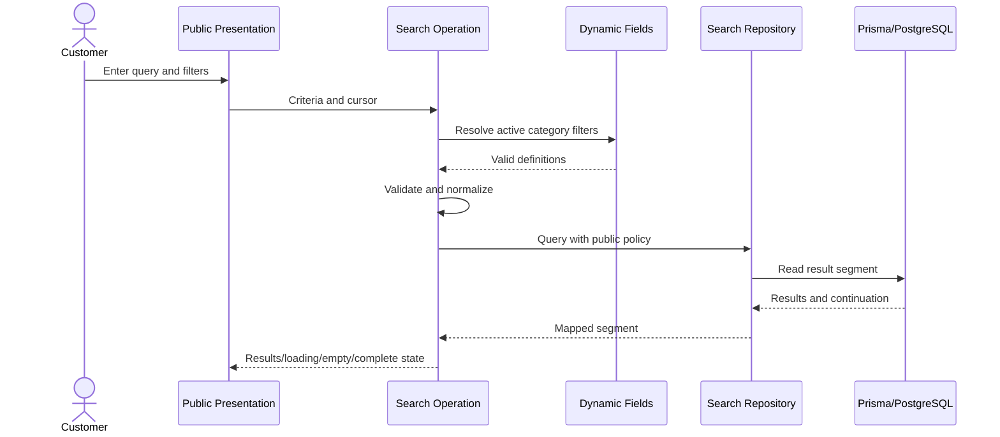
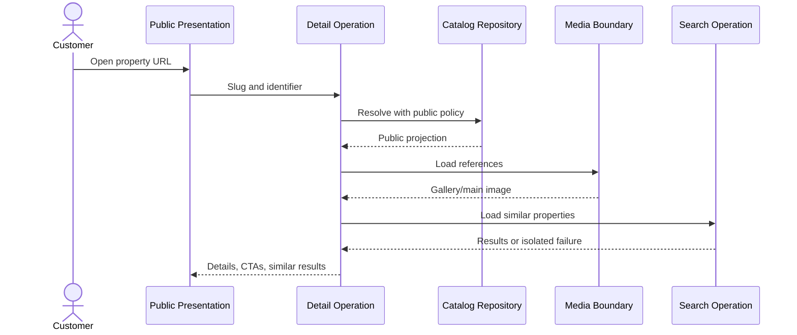
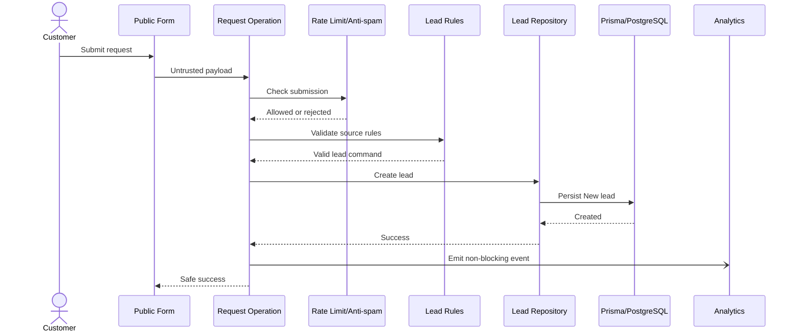
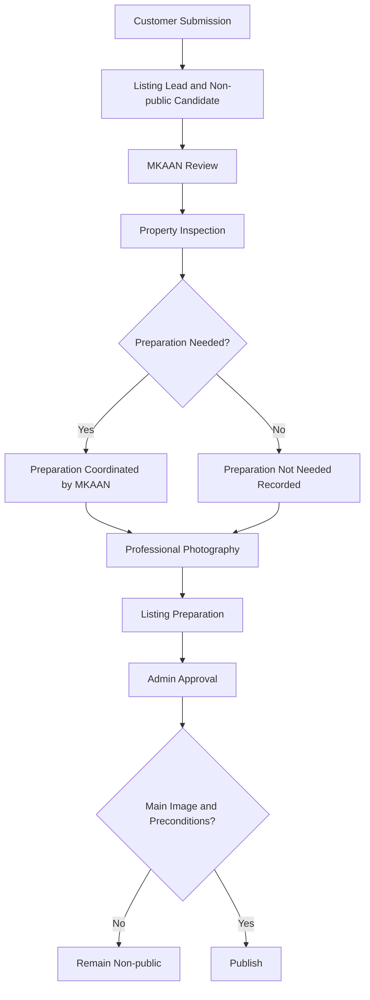
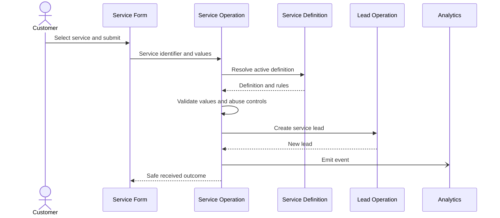
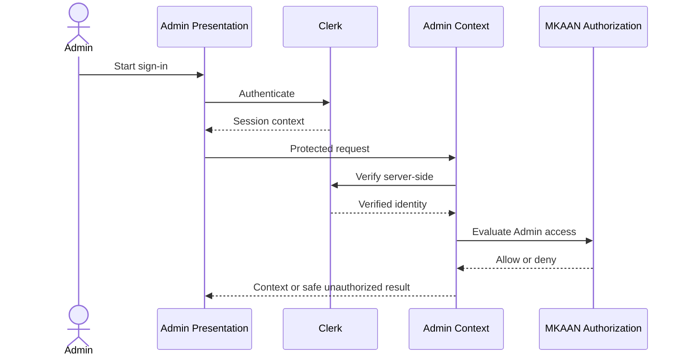
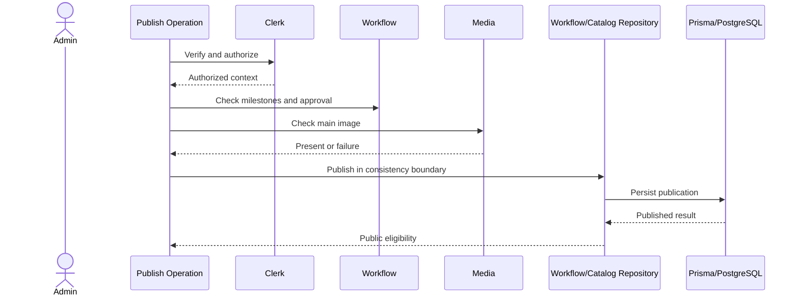
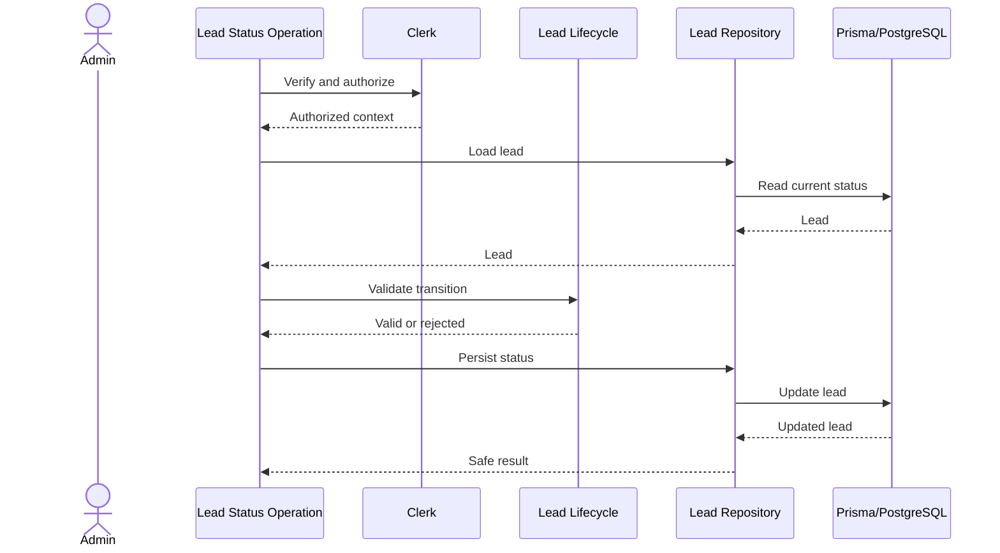
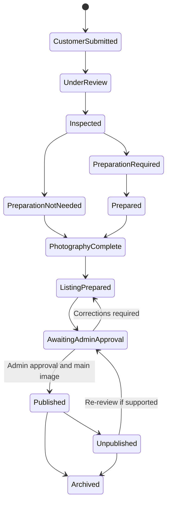
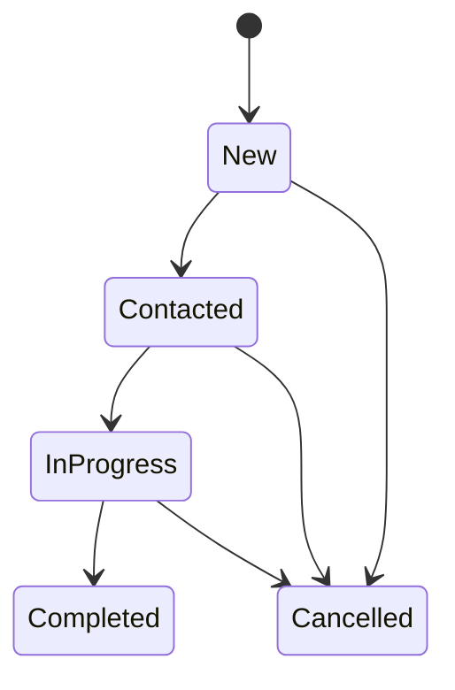

  # MKAAN Software Design

**Project:** MKAAN  
**Document status:** Consolidated MVP Software Design and single source of truth for the Software Design phase  
**Language:** Arabic-only MVP  
**Direction:** Right-to-left (RTL)  
**Last updated:** 2026-08-21

This document consolidates the approved design content from the architecture, software design, and technology-stack documents. It is a design specification only. It does not define application source code, pages, React components, Prisma schemas, migrations, Server Actions, Route Handlers, API routes, production configuration, provider implementation, deployment configuration, or tests.

## 1. Authority and Scope

### 1.1 Consolidated sources

The following Design files were merged into this document:

1. `docs/design/MKAAN-ARCHITECTURE.md`
2. `docs/design/MKAAN-DESIGN.md`
3. `docs/design/MKAAN-TECH-STACK.md`

The Requirements and SRS documents were not merged. They remain the authoritative sources for product requirements and observable behavior:

- `docs/requirements/MKAAN-REQUIREMENTS.md`
- `docs/requirements/MKAAN-SRS.md`

### 1.2 Authority hierarchy

The authority order remains:

1. Requirements
2. SRS
3. Architecture decisions
4. This consolidated Software Design

Requirements remain authoritative for scope, exclusions, business rules, priorities, and deferred decisions. The SRS remains authoritative for observable behavior. This document consolidates and organizes Design decisions; it must not weaken or change the Requirements or SRS.

### 1.3 Purpose

This phase translates approved requirements, SRS behavior, architecture, and confirmed technology decisions into implementation-ready technical and business boundaries. Later implementation planning should not need to invent major architectural or business decisions.

### 1.4 Design scope

This document defines:

- Full-stack Next.js modular-monolith structure.
- Public and Admin boundaries.
- Presentation, application, domain, data-access, and integration boundaries.
- Feature module responsibilities, ownership, dependencies, and rules.
- Conceptual domain and database design without a Prisma schema.
- Dynamic property fields and dynamic service-form mechanisms.
- Use cases, server-side application operations, validation, security, and consistency.
- Lead lifecycle and listing publication workflow.
- Search, incremental loading, media, SEO, analytics, reliability, and performance boundaries.
- Mermaid flow diagrams, conceptual state machines, and traceability.

### 1.5 Explicit exclusions

This phase does not authorize or create:

- Customer accounts, customer authentication, customer profiles, customer dashboards, or customer roles.
- Separate backend applications, microservices, real-time chat, complex role systems, complex booking engines, online payments, mobile applications, wishlists, favorites, or unrequested notifications.
- Pages, UI/UX design, production UI components, or visual design specifications.
- Prisma schemas, tables, migrations, seeds, Server Actions, Route Handlers, API routes, or production configuration.
- Image-storage provider implementation, analytics-provider implementation, hosting, monitoring, backup, or deployment configuration.
- A testing framework or test files.
- Exact public form fields, exact service fields, exact dynamic-field type vocabulary, or exact publication status vocabulary where those decisions remain deferred.

## 2. Confirmed Technology Baseline

### 2.1 Core

- **Next.js 16:** Full-stack application framework and application boundary.
- **React 19:** UI runtime.
- **TypeScript:** Primary language across presentation, application, domain, and data-access contracts.
- **Next.js App Router:** Routing and server/client composition model.
- **Modular Monolith:** One Next.js application containing isolated feature modules. No separate backend application or microservices.

### 2.2 Presentation and forms

- **Tailwind CSS:** Styling and RTL layout support.
- **shadcn/ui:** Reusable accessible presentation primitives.
- **Lucide React:** Icons.
- **React Hook Form:** Client-side form state and interaction.
- **Zod:** Structural input contracts and shape validation.

Client-side validation is an interaction aid only. The server is authoritative for required values, dynamic values, service forms, prices, uploads, filters, and lead submissions.

### 2.3 Server and data

- **Next.js Full-Stack:** Hosts public and Admin experiences, application operations, domain coordination, and integration boundaries.
- **Prisma:** The only ORM and data-access boundary.
- **PostgreSQL:** Relational database and system of record.
- **Neon:** Confirmed PostgreSQL provider.

The required boundary is:

```text
Presentation
  -> Server-side application operations
  -> Domain rules
  -> Feature-owned repositories/data-access services
  -> Prisma
  -> PostgreSQL on Neon
```

### 2.4 Authentication

- **Clerk:** Authentication provider for Admin users.
- **Current scope:** Admin authentication, server-side authentication verification, and server-side authorization.
- **Customer authentication:** Deferred to a future phase. Customers remain anonymous in the MVP.

Clerk owns authentication identity and session verification. MKAAN owns the decision whether a verified Clerk identity is authorized to perform an Admin operation.

### 2.5 Code quality, package management, and version control

- **ESLint:** Static linting and code-quality rules.
- **Prettier:** Formatting consistency.
- **pnpm:** Package management.
- **Git:** Version control.
- **GitHub:** Repository collaboration.

### 2.6 Deferred technologies

- **Image storage provider:** Deferred. Use a replaceable media-storage boundary. Do not store Base64 image data in PostgreSQL.
- **Analytics provider:** Deferred. Facebook Pixel and TikTok Pixel remain optional and unselected.
- **Hosting/deployment provider:** Deferred.
- **Monitoring provider:** Deferred.
- **Backup provider:** Deferred.
- **Testing stack:** Deferred. Testing implementation is postponed.

### 2.7 Technology responsibilities and constraints

| Technology | Layer | Owns | Must not own |
| --- | --- | --- | --- |
| Next.js 16 | Application boundary | Full-stack runtime and server/client composition | Domain policy or UI-only authorization |
| React 19 | Presentation | Rendering and interaction | Persistence or authoritative validation |
| App Router | Entry boundary | Route composition and experience boundaries | Business rules or Prisma access |
| TypeScript | All layers | Static contracts | Runtime validation by itself |
| Tailwind CSS | Presentation | Styling and RTL layout | Business behavior |
| shadcn/ui | Presentation | Accessible visual primitives | Domain logic, data access, authorization |
| Lucide React | Presentation | Icons | Business decisions |
| React Hook Form | Presentation | Form interaction/state | Server trust or lead creation |
| Zod | Validation boundary | Input shape validation | Authorization or business rules by itself |
| Prisma | Data access | ORM queries, mapping, PostgreSQL access | UI, Clerk, or external provider policy |
| PostgreSQL | Persistence | Durable relational data and integrity | Image binaries or analytics provider behavior |
| Neon | Database provider | PostgreSQL provider boundary | Business rules or repository contracts |
| Clerk | Authentication integration | Admin identity and session verification | Customer accounts or MKAAN authorization policy |
| ESLint/Prettier | Code quality | Linting and formatting | Runtime security or business behavior |
| pnpm | Tooling | Dependencies | Runtime behavior |
| Git/GitHub | Collaboration | History and repository collaboration | Hosting, monitoring, or backup guarantees |

Constraints:

- Prisma is the only ORM/data-access layer.
- PostgreSQL is the database technology and Neon is its confirmed provider.
- Clerk handles Admin authentication.
- Server-side authorization protects every Admin operation and mutation.
- Customers remain anonymous in the MVP.
- Business rules do not live inside UI components.
- Presentation does not access Prisma directly.
- Deferred providers remain replaceable and do not leak into domain contracts.
- The application remains a modular monolith.
- Arabic-only customer-facing content and RTL behavior are MVP constraints.

## 3. Architecture Overview

### 3.1 Goals and principles

The architecture must support public property discovery, search, filtering, details, category-aware fields and filters, anonymous customer request flows, MKAAN-controlled review and preparation, Admin publication approval, protected resource management, safe validation, incremental loading, mobile performance, secondary-failure isolation, and growth in properties, leads, categories, fields, locations, and services without enterprise complexity.

Principles:

1. Public and Admin behavior share one application boundary.
2. The server is authoritative for business rules, validation, publication, and authorization.
3. Feature modules own application behavior, domain rules, and data-access needs.
4. Prisma is isolated behind repositories or data-access services.
5. Public visibility is enforced by policy, not presentation behavior.
6. Deferred decisions remain replaceable ports.
7. Secondary failures do not unnecessarily break primary journeys.
8. The MVP does not introduce excluded identity, booking, payment, chat, or microservice scope.

### 3.2 Logical shape

```text
Public Experience                    Admin Experience
        |                                    |
        +------------ Presentation ----------+
                          |
              Server-side Application Boundary
                          |
               Feature Application Operations
                          |
                     Domain Rules
                          |
               Repository/Data-access Ports
                          |
                        Prisma
                          |
                  PostgreSQL on Neon
                          |
             Replaceable Integration Adapters
       Clerk | Media | Analytics | Abuse | Operations
```

### 3.3 Public boundary

Anonymous users may discover, search, filter, sort, and view approved/published properties. They may submit property, viewing, listing, service, and contact requests. The public boundary does not expose Admin operations, unpublished property data, leads, customer accounts, or customer profiles.

### 3.4 Admin boundary

The Admin experience is in the same application and requires Clerk authentication plus server-side MKAAN authorization. Authorized Admin users manage properties, categories, dynamic fields, locations, leads, services, and publication state, including publish, unpublish, and archive where appropriate.

### 3.5 Server-side application boundary

All operations that create leads, change lead status, create/update properties, change publication, manage definitions, or accept media enter the server-side boundary first. It performs request-context checks, structural validation, business validation, authorization where needed, domain coordination, repository calls, integration calls, and safe result mapping.

The concrete Next.js request mechanism is intentionally not selected.

### 3.6 Logical layers

**Presentation layer** renders public/Admin experiences, collects input, presents loading/empty/success/error/unauthorized states, and supports Arabic RTL, accessibility, and responsive behavior. It is not the authoritative validation or authorization layer and never accesses Prisma.

**Application layer** coordinates use cases, actor context, domain policies, repositories, integration ports, consistency boundaries, and safe outcomes. It does not render UI or construct raw Prisma queries.

**Domain layer** expresses category-aware values, service-form validity, publication prerequisites, lead sources/statuses, public visibility, and non-destructive handling. It depends on neither UI nor infrastructure.

**Data-access layer** encapsulates Prisma, query construction, mappings, public predicates, and feature-owned repositories.

**Integration layer** isolates Clerk, media storage, analytics, rate limiting/anti-spam, logging, monitoring, backups, recovery, and migration operations.

**Shared cross-cutting contracts** may cover validation primitives, error classes, authorization context, visibility policy, analytics events, SEO metadata, media validation, and incremental result contracts. Shared code must not become an unowned business-logic layer.

## 4. Feature Module Design

All feature modules expose application-level contracts, own their domain rules, and use approved cross-module interfaces. No module queries another module's tables directly or bypasses its business boundary.

### 4.1 Property Catalog

**Responsibilities:** General property data, sale/rental type, categories, locations, public summaries/details, featured-property representation, publication visibility reads, and similar-property coordination.

**Owned concepts:** Property, Location, catalog category reference, property projections, public visibility policy.

**Inputs:** Property identifiers, category/location references, transaction type, price, description, dynamic values, and publication context.

**Outputs:** Public-safe summaries/details, Admin property projections, locations, and category-aware property data.

**Dependencies:** Dynamic Fields, Media, Listing Workflow policy, Search read contract, SEO projections, repositories.

**Forbidden:** Direct Prisma from presentation, direct storage-provider access, direct Clerk calls in domain rules, visibility bypass, and direct lead creation.

**Rules:** Only approved/published properties are public. Price is server-validated. Category data is resolved through Dynamic Fields. Similar-property failure is isolated.

### 4.2 Categories and Dynamic Fields

**Responsibilities:** Category definitions, field definitions, explicit category-field applicability, options, field type, required/filterable/displayable flags, display order, active state, and server-side value validation.

**Owned concepts:** Category, Dynamic Field Definition, category-field assignment, field option, property dynamic-value contract.

**Inputs:** Definition metadata and submitted field identifiers/values.

**Outputs:** Active category definitions, normalized valid values, display metadata, and dynamic filter definitions.

**Dependencies:** Property Catalog context, Search filter contract, Admin policy, repositories.

**Rules:** Reject unknown IDs, unrelated category fields, inactive fields, invalid types/options, and missing required values. Definition metadata controls property display and filtering.

### 4.3 Property Search

**Responsibilities:** Text, category, transaction, location, price, dynamic filtering, sorting, incremental result retrieval, loading, empty, complete, and invalid-filter behavior.

**Owned concepts:** Search criteria, dynamic-filter criteria, sort contract, continuation contract, result segment.

**Inputs:** Text, category, transaction, location, price bounds, dynamic filters, sort, and continuation cursor.

**Outputs:** Validated criteria, result segment, continuation state, empty outcome, complete outcome, or safe error.

**Dependencies:** Catalog reads, Dynamic Fields, repositories, visibility policy, optional analytics.

**Rules:** Only public properties are queried. Category changes remove or exclude irrelevant filters. Invalid filters are rejected or excluded, never treated as valid.

### 4.4 Property Details and CTA

**Responsibilities:** Published property details, general/category data, price, location, description, media, relevant CTAs, CTA ordering before similar properties, and secondary similar-property retrieval.

**Inputs:** Public slug/identifier and CTA context.

**Outputs:** Public detail, gallery references, CTA context, optional similar results.

**Dependencies:** Catalog, Media, Search secondary read, Leads CTA contracts, SEO, Analytics.

**Rules:** Missing, invalid, unpublished, or archived public access does not expose data. Similar-property failure does not fail primary detail. Viewing CTA leads to a request, not a booking.

### 4.5 Customer Requests and Leads

**Responsibilities:** Anonymous property, viewing, listing, and contact requests; source assignment; lead creation; supported status management; non-destructive handling.

**Owned concepts:** Lead, source/type, request contracts, lifecycle, optional property/service references, future optional customer identity reference.

**Dependencies:** Catalog public reads, Services, Listing Workflow intake, Admin policy, repositories, Analytics.

**Rules:** Valid submissions create the correct lead; invalid submissions create none. Viewing requests are not bookings. Supported statuses are New, Contacted, In Progress, Completed, and Cancelled. Leads are not normally permanently deleted.

### 4.6 Listing Workflow and Publication

**Responsibilities:** Listing intake, MKAAN review, inspection, preparation decision, professional photography, listing preparation, Admin approval, publish, unpublish, archive, and public visibility policy.

**Required workflow:**

```text
Customer Submission
  -> MKAAN Review
  -> Property Inspection
  -> Preparation if Needed
  -> Professional Photography
  -> Listing Preparation
  -> Admin Approval
  -> Publish
```

**Rules:** Listing intake creates a lead and non-public candidate. It never publishes. Pre-approval stages remain non-public. MKAAN coordinates preparation and professional photography. Publication requires the required workflow, Admin approval, valid property data, and a main image. Unpublish/archive removes public visibility and indexability.

Exact persisted states, transition permissions, and operational evidence remain deferred.

### 4.7 Services

**Confirmed services:** Finishing, Maintenance, and Prepare Your Property for Sale/Rent.

**Responsibilities:** Unified entry point, service selection, active form resolution, service-specific dynamic validation, and service lead creation.

**Rules:** The selected service controls the form and validation. Unsupported/inactive services and unrelated/unknown/inactive service fields are rejected. Exact service fields and representative example remain deferred.

### 4.8 Admin Management

**Responsibilities:** Protected Admin entry, Clerk context verification, MKAAN authorization, and management operations for properties, categories, fields, locations, leads, services, and publication.

**Rules:** Every protected operation checks authentication and authorization server-side. UI visibility is not authorization. No additional roles or complex role system is introduced. Feature business rules remain in the feature modules.

### 4.9 Media

**Responsibilities:** Property media references, main-image designation, galleries, server-side upload validation, secure file boundary, retrieval, and failure isolation.

**Rules:** Multiple images are supported. Every published property has a main image. Media uses a replaceable storage port and never stores Base64 image data in PostgreSQL. One failed image does not break the gallery.

### 4.10 SEO

**Responsibilities:** Latin/English slug plus unique identifier, dynamic title/meta description, canonical URL, Open Graph, social image reference, structured-data boundary, sitemap eligibility, robots behavior, and 404 behavior.

**Rules:** Only approved/published properties are indexable or sitemap-eligible. Search/filter combinations do not generate unlimited indexable pages. Location/category pages require future meaningful-content policy. Exact structured-data types and meaningful-content rules remain deferred.

### 4.11 Analytics

**Responsibilities:** Event contracts, privacy filtering, replaceable provider delivery, and non-blocking failure isolation.

**Events:** Property view, search, filter applied, viewing request started/submitted, property request submitted, listing request submitted, service request submitted, contact submitted, and CTA click.

**Rules:** Events must exclude unnecessary phone numbers and full request content. Analytics failure never blocks a form, lead, success outcome, or primary journey. Facebook Pixel and TikTok Pixel remain optional and unselected.

## 5. Domain Model

### 5.1 Domain entities versus database models

A domain entity represents a business concept with identity, rules, relationships, and lifecycle. A database model is a PostgreSQL/Prisma persistence representation. Repositories map between them. Database normalization must not become the source of business rules.

No Prisma model names, schema fields, enums, tables, or migrations are defined here.

### 5.2 Property

Represents a real-estate property managed by MKAAN. Important concepts include stable identity, Arabic content, Latin/English slug, unique URL identifier, transaction type, category, location, price, description, dynamic values, featured representation, media, and publication context.

It belongs to one category and one catalog location, has zero or more dynamic values and media items, and may be referenced by many leads. Category, transaction type, location, price, and description are required concepts for a usable catalog record subject to approved form rules. Dynamic values may be optional unless a field is required. Publication requires completed workflow, Admin approval, valid data, and a main image.

### 5.3 Category

Classifies properties and explicitly determines applicable fields and filters. One category has many properties and many category-field assignments. A field is not applicable without an explicit assignment. Inactive definitions are excluded from active behavior; deactivation must not silently reinterpret existing data.

### 5.4 Location

Managed geographic reference used by property details and filtering. A location may have many properties. Exact target governorate/area and hierarchy remain deferred.

### 5.5 Dynamic Field Definition

Defines field type, required/optional state, filterability, displayability, options when applicable, display order, active state, and category applicability. A field may apply to many categories only through explicit assignments. Exact field-type vocabulary and detailed constraints remain deferred.

### 5.6 Property Dynamic Value

Stores a validated property-field value. It belongs to one property and one field definition. Unknown, unrelated, inactive, invalid, or disallowed option values are never persisted through an application operation.

### 5.7 Lead

Represents a valid property, viewing, listing, service, or contact request. It includes source/type, status, source-specific request data, approved contact data, timestamps, optional property/service associations, and non-destructive handling metadata.

Viewing leads require a public property. Service leads require a service. Property requests and contact requests may not reference either. Listing leads may initially have no property and later associate with a non-public candidate.

### 5.8 Service Definition and Form Field

Defines a supported service and its active dynamic form. It includes service identity, Arabic content, active state, order, dynamic fields, required flags, type, and options where applicable. Exact fields and constraints remain deferred.

### 5.9 Property Media Reference

Non-Base64 reference to stored media with property association, storage reference, ordering, main-image marker, alt-text/content reference, and availability metadata where needed. A property has many media references and at most one designated main image.

### 5.10 Publication Workflow Context

Captures completion evidence for review, inspection, preparation decision, photography, listing preparation, Admin approval, and visibility. One current workflow context is associated with a property; history may be retained if later approved. Exact states and transition permissions remain deferred.

### 5.11 Future customer identity reference

A nullable external identity reference may later associate a customer with many leads. It is absent in the MVP and is not a customer account, profile, role, or dashboard.

## 6. Conceptual Database Design

### 6.1 Boundary

PostgreSQL on Neon is the system of record. Prisma is the only ORM/data-access layer. Feature repositories encapsulate queries, mapping, visibility predicates, and transactions. No schema or migration is created in this phase.

### 6.2 Ownership map

| Persistence area | Owner | Relationships |
| --- | --- | --- |
| Property catalog | Property Catalog | Category, Location, media, values, leads |
| Categories and fields | Dynamic Fields | Categories, fields, options, property values |
| Dynamic values | Property Catalog with field rules | Property and field |
| Locations | Catalog/Admin | Properties |
| Workflow/publication | Listing Workflow | Property, listing lead, media readiness |
| Leads | Requests and Leads | Optional property, service, future identity |
| Services/forms | Services | Fields and service leads |
| Media references | Media | Property and storage reference |
| SEO projections | SEO | Published property and media |
| Analytics events | Analytics | External delivery, not required business persistence |

### 6.3 Cardinality

- One category has many properties.
- One location has many properties.
- Categories and fields are many-to-many through explicit applicability.
- One property has many dynamic values and many media references.
- One property has at most one designated main image at a time.
- One property may have many related leads.
- One service has many service fields and service leads.
- A lead may reference zero or one property and zero or one service according to source.
- A future customer identity may reference many leads; no such identity exists in the MVP.

### 6.4 Constraints and integrity

Persistence should enforce uniqueness for stable identifiers, public slug/unique-identifier combinations, category-field assignments, field options within a field, single-valued property-field associations, service-field applicability, and valid storage references where duplicates are invalid.

Foreign keys should prevent orphaned values, media, assignments, fields, and lead associations. Deactivation, unpublishing, and archiving are preferred to destructive deletion when history matters.

### 6.5 Query-critical indexes

Indexes should support public visibility with category/transaction/location/order, price, slug/identifier lookup, featured ordering, dynamic field/value filtering, Lead status/source/property/service/creation time, active field applicability/filter/display order, active service field order, and media order/main-image lookup. Final indexes are confirmed during implementation planning from measured access patterns.

### 6.6 Optional relationships

- Lead-to-property is nullable except required for viewing.
- Lead-to-service is nullable except required for service leads.
- Lead-to-future-customer identity is nullable for all MVP leads.
- Property-to-main-image is nullable before publication and required by publish.
- Field options are absent for non-option field types.
- Preparation may be recorded as not needed without introducing a new service.

### 6.7 Public visibility predicate

Every public listing, detail, similar-property, SEO, and sitemap query applies one shared policy equivalent to:

```text
property is approved
AND property is published
AND property is not unpublished
AND property is not archived
```

Draft, under-review, being-prepared, awaiting-approval, unpublished, and archived properties are not public. The final persisted vocabulary is deferred. Public repositories cannot accept a caller flag that bypasses this predicate.

## 7. Dynamic Fields and Service Forms

### 7.1 Dynamic property fields

Categories explicitly define applicable fields. An active field requires an active definition and explicit category assignment. Each definition supports field type, required/optional, filterable/non-filterable, displayable/non-displayable, options where applicable, display order, and active/inactive state.

The exact type vocabulary and per-type constraints are not specified by the authoritative documents and remain deferred.

The server resolves the selected category and active definitions before accepting values. It rejects:

- Unknown field IDs.
- Fields not assigned to the selected category.
- Inactive fields.
- Missing required values.
- Invalid field types.
- Invalid option values.
- Duplicate or ambiguous values where a field is single-valued.

Only active filterable fields become filters. Only active displayable fields become public category-specific detail fields. Existing values remain interpretable when definitions are deactivated; new active operations reject inactive fields.

### 7.2 Service forms

The three supported services are Finishing, Maintenance, and Prepare Your Property for Sale/Rent. Each service resolves an active dynamic form definition. The selected service remains associated with the request and lead.

The server resolves the service before validating values and rejects unsupported/inactive services, unknown/unrelated/inactive service fields, missing required values, invalid types, and invalid options. Exact fields, detailed constraints, and the representative demonstration service remain deferred. No service request is a booking, quote, payment, or guaranteed appointment.

## 8. Use Cases

### 8.1 Public use cases

#### Search, filter, and sort properties

- **Actor:** Anonymous customer.
- **Preconditions:** Public search boundary is available; category is valid if supplied.
- **Inputs:** Text, category, sale/rental type, location, price bounds, dynamic filters, sort, and continuation cursor.
- **Validation:** Shape, identifier, category definitions, active filter definitions, options, price, cursor, and sort.
- **Rules:** Only public properties qualify. Category changes remove/exclude irrelevant filters.
- **Flow:** Resolve active definitions, normalize criteria, apply visibility policy, query incremental segment, return continuation/loading/empty/complete state.
- **Failures:** Invalid criteria/cursor, query failure, or no matches. Empty results are not errors.
- **Side effects:** Optional non-blocking search/filter analytics.

#### View property

- **Actor:** Anonymous customer.
- **Preconditions:** Approved URL identifier format.
- **Inputs:** Latin/English slug and unique identifier.
- **Validation:** Identifier and public visibility predicate.
- **Rules:** Unpublished/missing content is unavailable. CTAs precede similar properties. Similar-property and individual-media failure is isolated.
- **Flow:** Load public details and media, resolve relevant CTAs, attempt similar properties secondarily, return safe detail.
- **Side effects:** Optional property-view analytics.

#### Submit property request

- **Actor:** Anonymous customer.
- **Preconditions:** Public form available; no account.
- **Inputs:** Approved property-request payload; exact fields deferred.
- **Validation:** Structure, required values, business rules, rate limit, anti-spam.
- **Rules:** Valid submission creates a New property-request lead; invalid submission creates none.
- **Result:** Safe received outcome or safe failure.
- **Side effects:** Atomic lead creation; analytics is non-blocking.

#### Submit viewing request

- **Actor:** Anonymous customer.
- **Preconditions:** Referenced property is currently public.
- **Inputs:** Property identifier and approved viewing payload.
- **Validation:** Public visibility, form rules, rate limit, anti-spam.
- **Rules:** Creates a viewing lead, not a booking. MKAAN confirms separately.
- **Result:** Safe received outcome, not-found, validation error, or safe failure.

#### Submit listing request

- **Actor:** Anonymous customer.
- **Preconditions:** Listing form available.
- **Inputs:** Approved listing payload and optional supported media context; exact fields deferred.
- **Validation:** Form, upload safety where supported, rate limit, anti-spam.
- **Rules:** Creates listing lead/non-public candidate. Never publishes.
- **Result:** Non-public intake result or safe failure.

#### Submit contact request

- **Actor:** Anonymous customer.
- **Preconditions:** Contact flow available.
- **Inputs:** Approved contact payload; exact fields deferred.
- **Validation:** Structure, business rules, rate limit, anti-spam.
- **Rules:** Valid submission creates a New contact lead.
- **Result:** Safe received outcome or safe failure.

#### Submit service request

- **Actor:** Anonymous customer.
- **Preconditions:** Selected service is active and supported.
- **Inputs:** Service identifier and dynamic form values.
- **Validation:** Service definition, active fields, required values, types/options, rate limit, anti-spam.
- **Rules:** Valid submission creates a New service lead.
- **Result:** Safe received outcome or correction/failure.

### 8.2 Admin use cases

#### Admin login

- **Actor:** Admin candidate.
- **Preconditions:** Clerk boundary available.
- **Flow:** Authenticate with Clerk, verify server-side context, evaluate MKAAN Admin policy, allow or deny.
- **Failures:** Unauthenticated, invalid context, or authenticated but unauthorized identity.
- **Result:** Protected Admin context or safe authentication/authorization outcome.

#### Manage properties

- **Actor:** Authorized Admin.
- **Inputs:** Property general data, category, location, price, dynamic values, media, and workflow commands.
- **Validation:** Authorization, structural data, price, category-aware fields, references, media, and workflow rules.
- **Rules:** Cannot bypass publication policy or publish through ordinary listing update.
- **Result:** Updated Admin projection or safe failure.

#### Manage categories and dynamic fields

- **Actor:** Authorized Admin.
- **Inputs:** Category/field definitions, flags, options, applicability, active state, and display order.
- **Validation:** Authorization, structure, uniqueness, option compatibility, and historical-data safety.
- **Rules:** Explicit applicability is required. Deactivation removes definitions from active forms/filters without silently invalidating history.

#### Manage locations

- **Actor:** Authorized Admin.
- **Inputs:** Location data and active state.
- **Validation:** Authorization, structure, uniqueness, and reference safety.
- **Rules:** Existing historical properties retain interpretable location references.

#### Manage leads

- **Actor:** Authorized Admin.
- **Inputs:** Lead filters/details, status change, and non-destructive handling command.
- **Validation:** Authorization, lead identifier, supported statuses, transition policy, and conflict context.
- **Rules:** Leads are not normally permanently deleted. Exact transition permissions remain deferred.

#### Manage services

- **Actor:** Authorized Admin.
- **Inputs:** Service/form definitions, fields, options, active state, and order.
- **Validation:** Authorization, supported service, active definition, applicability, and option compatibility.
- **Rules:** Only the three confirmed services are MVP scope.

#### Publish, unpublish, and archive property

- **Actor:** Authorized Admin.
- **Publish preconditions:** Existing property, completed workflow, professional photography, Admin approval, valid public data, and main image.
- **Publish result:** Public eligibility only after the consistency boundary succeeds.
- **Unpublish/archive rules:** Remove public visibility/indexability without destructive deletion.
- **Failures:** Unauthorized, missing record, incomplete workflow, missing image, invalid state, conflict, or persistence failure.

## 9. Application Operations

These are conceptual server-side operations. This document intentionally does not choose Server Actions, Route Handlers, API endpoints, or page invocation mechanisms.

| Operation | Input | Output | Rules/dependencies |
| --- | --- | --- | --- |
| `SearchPublishedProperties` | Criteria, sort, cursor | Result segment and continuation | Category-aware validation, public predicate, Search/Catalog repositories |
| `GetPublishedPropertyDetail` | Slug and identifier | Public detail and optional secondary data | Public predicate; Media/Search/SEO secondary reads isolated |
| `ResolveCategoryFields` | Category identifier | Active field/filter/display definitions | Active category and Dynamic Fields repository |
| `SubmitPropertyRequest` | Form payload and abuse context | Safe received result | Shape/business/rate-limit validation; atomic lead |
| `SubmitViewingRequest` | Public property identifier and payload | Safe received result | Public property check plus atomic viewing lead |
| `SubmitListingRequest` | Listing payload and media context | Non-public intake result | Never publishes; atomic lead/candidate intake |
| `SubmitContactRequest` | Contact payload and abuse context | Safe received result | Atomic contact lead |
| `ResolveServiceForm` | Service identifier | Active form definition | Active supported service |
| `SubmitServiceRequest` | Service identifier, dynamic values, abuse context | Safe received result | Service-aware validation and atomic lead |
| `GetAdminContext` | Clerk server context | Authorized Admin context | Clerk verification plus MKAAN policy |
| `ManageProperty` | Property command | Admin projection | Authorization, category/field/price/media/workflow rules |
| `ManageCategory` | Category command | Admin category projection | Authorization and uniqueness |
| `ManageDynamicField` | Field/options/applicability command | Admin field projection | Authorization and definition rules |
| `ManageLocation` | Location command | Admin location projection | Authorization and reference rules |
| `ManageLead` | Lead query/status command | Admin lead projection | Authorization and lifecycle rules |
| `ManageService` | Service/form command | Admin service projection | Authorization and service rules |
| `PublishProperty` | Property and approval command | Published/non-public result | Workflow, approval, media, visibility; transaction required |
| `UnpublishProperty` | Property command | Non-public result | Authorized visibility change |
| `ArchiveProperty` | Property command | Archived result | Authorized non-destructive visibility change |
| `AttachPropertyMedia` | Property/media command | Media reference | Upload validation and storage port; isolated provider failure |
| `ResolvePropertySEO` | Public URL context | Metadata or not-found | Published predicate |
| `GetSitemapEntries` | Sitemap context | Eligible entries | Published/approved predicate |
| `EmitAnalyticsEvent` | Privacy-safe event envelope | Delivery outcome | Non-blocking deferred adapter |

Every operation returns a typed outcome distinguishing success, validation, authentication, authorization, not-found, business-rule, conflict, and infrastructure failure.

## 10. Validation and Security

### 10.1 Validation pipeline

```text
Input
  -> Request Context Check
  -> Shape and Basic Validation
  -> Business Rule Validation
  -> Category/Service Definition Validation
  -> Authorization Check where Protected
  -> Application Operation
  -> Safe Result or Safe Error
```

### 10.2 Validation layers

- **Input shape:** Zod validates structure, primitive types, required structural fields, bounded lengths, identifiers, and safe collection sizes.
- **Business rules:** Domain policies validate price, relationships, publication, lead sources/statuses, visibility, and viewing-not-booking behavior.
- **Dynamic fields:** Resolve category and active definitions; reject unknown, unrelated, inactive, missing-required, invalid-type, and invalid-option values.
- **Service forms:** Resolve active service; reject unsupported service, unknown/unrelated/inactive fields, missing-required, invalid types, and invalid options.
- **Search/filter:** Validate category, transaction, location, price, dynamic filters, sort, cursor, active definitions, and visibility.
- **Publication:** Validate authorization, workflow evidence, photography, approval, data, and main image.
- **Lead:** Validate source-specific property/service associations, status vocabulary, and non-destructive handling.
- **Media:** Validate content server-side, reject unsafe content, avoid Base64, and verify storage references.
- **Admin:** Verify Clerk context, MKAAN authorization, operation payload, domain state, and conflicts.

### 10.3 Authentication and authorization

Clerk authenticates Admins. The server verifies Clerk context before protected operations. MKAAN applies an Admin authorization policy before every protected read or mutation. Exact membership/allowlist/claim configuration remains deferred under `DEFER-009`; no multi-role model is added.

Public property reads and customer forms are anonymous. Public forms rely on validation, rate limiting, anti-spam, safe input handling, and visibility rules rather than customer identity.

Unauthorized behavior is safe: unauthenticated protected access is authentication-required, authenticated but unauthorized access is forbidden, and unpublished/missing public content is unavailable/not-found without disclosure.

### 10.4 Security controls

- Treat all public and Admin input as untrusted.
- Use server-side validation as the authority.
- Apply rate limiting and anti-spam to every public form.
- Validate uploads independently of client metadata.
- Keep media outside PostgreSQL as non-Base64 references.
- Apply visibility predicates before public data returns.
- Protect leads and customer request data from public exposure.
- Keep analytics free of unnecessary phone numbers and full request content.
- Use Prisma only behind repositories with validated query values.
- Use HTTPS in production and environment variables for secrets.
- Never expose stack traces, SQL, Prisma internals, provider credentials, Clerk tokens, secrets, or raw exception messages.

## 11. Leads and Listing Publication

### 11.1 Lead sources and lifecycle

Confirmed lead sources are viewing, property, listing, service, and contact requests. Valid submissions create a lead with status **New**. Supported statuses are:

- **New:** Received and not yet handled.
- **Contacted:** Contacted or attempted contact.
- **In Progress:** Actively handled.
- **Completed:** Requested handling complete.
- **Cancelled:** Will not continue.

The required progression is New -> Contacted -> In Progress -> Completed, with Cancelled available when applicable. Exact transition permissions and reopen behavior remain deferred. Leads should not normally be permanently deleted.

Viewing requests are requests, not confirmed bookings, time reservations, or booking-engine state.

### 11.2 Anonymous and future identity

No customer account, registration, profile, session, or dashboard is required. A nullable future external identity reference may later be associated with many leads without changing anonymous lead creation, source types, or lifecycle.

### 11.3 Publication workflow

Conceptual conditions are Customer Submitted, Under Review, Inspected, Preparation Required or Not Needed, Prepared where required, Photography Complete, Listing Prepared, Awaiting Admin Approval, Approved/Published, Unpublished, and Archived.

All pre-publication states are non-public and non-indexable. Publication requires completion of required workflow steps, professional photography handled by MKAAN, Admin approval, valid property data, and a main image. Exact persisted state names, rework rules, transition permissions, operational evidence, and internal actor policy remain deferred.

Unpublishing and archiving are non-destructive and remove public visibility, public detail access, search eligibility, SEO eligibility, and sitemap eligibility.

## 12. Search, Media, SEO, and Analytics

### 12.1 Search and incremental loading

Search supports text, category, sale/rental type, location, price, dynamic category-specific filters, sorting, and incremental loading. The selected category determines active filters. Applicable filters may remain across category changes; irrelevant filters are removed or excluded. Invalid filters never remain valid active criteria.

Results are returned as ordered segments with continuation information bound to validated criteria and sort context. Page size and cursor encoding remain implementation details. Featured-property ranking is required as a capability but its exact ordering logic is not defined and remains isolated behind a policy.

Valid no-match results produce an empty state. Loading and complete-result states are distinct from errors. Public queries select only data needed by the current projection and use appropriate indexes.

### 12.2 Media

Properties support multiple images, a gallery, and one main image. The Media module uses an image-storage port that accepts validated content and returns a non-Base64 reference. Provider, object layout, CDN, processing, limits, formats, and retention are deferred.

Publication verifies a usable main-image reference. A failed image produces a media-level failure and does not break unrelated gallery images or the primary property detail.

### 12.3 SEO

Property URLs use a Latin/English slug and unique identifier, for example `/properties/apartment-for-sale-shebin-el-kom-a8f32`. Public content and metadata remain Arabic. Eligible pages support dynamic title, meta description, canonical URL, Open Graph, social-sharing image, structured-data boundary, sitemap, robots behavior, and safe 404 handling.

Only approved/published properties are public/indexable. Search/filter combinations do not create unlimited indexable pages. Location/category indexability depends on meaningful content and the target geography, both deferred. Exact structured-data types remain deferred.

### 12.4 Analytics

Feature modules emit property view, search, filter, viewing-started/submitted, property-requested, listing-requested, service-requested, contact-submitted, and CTA-click events through a replaceable boundary. Payloads contain bounded non-sensitive context and exclude unnecessary phone numbers and full request content. Delivery is non-blocking and failure-isolated. Provider, queue, retry, and Facebook/TikTok implementation remain deferred.

## 13. Error Handling and Reliability

### 13.1 Error classes

- Validation error.
- Authentication error.
- Authorization error.
- Not found/unavailable.
- Business-rule failure.
- Database failure.
- External integration failure.
- Conflict where a concurrent state change prevents a safe update.

Public and Admin mappings are safe and do not reveal implementation details. Empty search results are not errors. Similar-property retrieval, individual media retrieval, analytics, and other secondary features must not unnecessarily break primary journeys.

### 13.2 Operational boundaries

Replaceable operational ports are reserved for error logging, monitoring, database backups, recovery procedures, and safe migrations. Exact tools, providers, and procedures remain deferred under `DEFER-012`.

### 13.3 Data change safety

All persisted changes occur through controlled server-side operations and Prisma repositories. Destructive deletion is not the default for leads or property visibility.

## 14. Data Access and Dependency Rules

### 14.1 Data-access boundary

Feature-owned repositories expose application/domain-shaped operations and encapsulate Prisma. Repositories construct safe parameterized queries from validated criteria, apply public visibility and field applicability predicates, select purpose-specific projections, and map records back to application/domain data.

Presentation never accesses Prisma. Domain policies never import Prisma or provider code. Public repositories do not expose a caller-controlled bypass for unpublished data.

```text
Presentation input
  -> Application operation
  -> Structural/business validation
  -> Domain policy
  -> Feature repository contract
  -> Prisma query/transaction
  -> PostgreSQL on Neon
  -> Mapping
  -> Safe outcome
```

### 14.2 Dependency rules

1. Presentation calls application operations only.
2. Application operations coordinate policies, repositories, and ports.
3. Domain rules depend on neither presentation nor infrastructure.
4. Public reads always use the shared visibility policy.
5. Request flows create leads through the Leads boundary.
6. Listing intake cannot publish as a side effect.
7. Media is accessed through the Media boundary.
8. Analytics is non-blocking.
9. Admin authorization runs before protected operations.
10. Feature modules use explicit interfaces, not another module's tables.
11. No circular business dependencies are allowed.

### 14.3 Dependency matrix

| Module | Allowed dependencies | Forbidden dependencies |
| --- | --- | --- |
| Property Catalog | Dynamic Fields, Media, Workflow policy, Search read contract, repositories | Direct UI/Prisma, provider calls, direct leads |
| Dynamic Fields | Catalog context, Search filter contract, repositories | UI authority, arbitrary values, unrelated service logic |
| Search | Catalog reads, Dynamic Fields, repositories, Analytics | Workflow mutation, lead creation, unpublished reads |
| Details/CTA | Catalog, Media, Search secondary read, Leads CTA, SEO, Analytics | Booking engine, unpublished exposure |
| Requests/Leads | Catalog public reads, Services, Workflow intake, repositories, Analytics | Customer auth now, automatic publication, direct storage |
| Workflow | Catalog, Media, Leads, Admin policy, repositories | Public-intake publication, provider UI logic |
| Services | Leads, repositories, shared validation | Invented fixed fields or unsupported services |
| Admin | Clerk adapter, feature operations, authorization | Client-only auth, direct Prisma, multi-role scope |
| Media | Storage port, Catalog/Workflow contracts, repositories | Base64 persistence, direct UI provider access |
| SEO | Catalog public reads, Media, visibility policy | Draft indexing, unlimited filter SEO |
| Analytics | Event contracts, provider port | PII-heavy payloads, blocking core actions |

## 15. Consistency and Transaction Design

Transactions are used only where partial success violates an explicit invariant.

### 15.1 Lead creation

Validation and lead creation form one business operation. Invalid submissions create no lead. Source/type and required property/service association are persisted consistently. Analytics remains outside the transaction.

### 15.2 Publication

Publication checks workflow, Admin approval, visibility state, valid property data, professional photography, and main image in one consistency boundary. A failed write must not make a property public.

### 15.3 Main image

Publishing must not leave a public property without a usable main-image reference. The implementation may use a database transaction or compensating media state, but the final publication check is mandatory.

### 15.4 Dynamic property updates

General property data and validated dynamic values should update atomically when one operation replaces the property representation. Invalid definitions/values fail before dependent writes succeed.

### 15.5 Lead status changes

Status validation and persistence are one operation. A concurrency conflict returns a safe conflict result rather than silently overwriting a newer status. Full event sourcing is not required.

## 16. Performance, Accessibility, and Responsive Boundaries

### 16.1 Performance

- Use server rendering appropriately for public property discovery/details and SEO.
- Minimize unnecessary client-side JavaScript.
- Return listing projections instead of full property/media data.
- Load images lazily and avoid unnecessary media.
- Retrieve results incrementally.
- Apply predicates and indexes in repositories.
- Keep similar properties secondary.
- Introduce caching only behind stable read boundaries and never expose private Admin data as public.
- Prioritize mobile performance and fast property pages.

No cache, CDN, hosting, image, or infrastructure provider is selected.

### 16.2 Accessibility and responsive behavior

These are presentation constraints, not UI/UX design decisions. Public and Admin experiences should support semantic HTML, keyboard navigation, visible focus, labeled forms, accessible errors, appropriate alt text, good contrast, reduced motion, and mobile/tablet/laptop/desktop/large-screen layouts. Critical areas include property cards, filters, gallery, forms, and Admin dashboard.

## 17. Testing Boundary

Testing implementation is postponed; no framework or test files are selected. The architecture remains testable because domain policies are independent of React, Clerk, Prisma, and providers; application operations can use repository/port test doubles later; repository contracts isolate Prisma/database tests; and critical flows are explicit.

Future testing priorities include dynamic-field validation, filter logic, business rules, price validation, lead transitions, customer forms, server operations, database operations, lead creation, publication, unpublication/archive, and the critical public/Admin flows specified by the SRS. This document does not create tests.

## 18. Sequence and Flow Designs

### 18.1 Property search



### 18.2 Property details



### 18.3 Customer lead submission



### 18.4 Listing workflow



### 18.5 Service request



### 18.6 Admin login



### 18.7 Admin publication



### 18.8 Admin lead status change



## 19. State Machines

### 19.1 Publication workflow



This is conceptual vocabulary only. Final state names, permissions, rework rules, and actor policy remain deferred. All pre-Published states are non-public.

### 19.2 Lead lifecycle



The required vocabulary is New, Contacted, In Progress, Completed, and Cancelled. Exact transition permissions and reopen behavior remain deferred. No additional status is introduced.

## 20. Traceability

| Requirements/SRS area | Design coverage | Status |
| --- | --- | --- |
| `PROJ-001` to `PROJ-007` | Scope, technology, architecture | Fully covered |
| `OBJ-001` to `OBJ-008` | Modules, use cases, operations, flows | Fully covered |
| `AUTH-*`, `CUSTOMER-*`, `ADMIN-*` | Public/Admin boundaries, Clerk, authorization | Covered; Admin policy configuration deferred |
| `PROP-*`, `DETAIL-*` | Catalog, domain, database, details, visibility | Fully covered; exact field constraints deferred |
| `FIELD-*` | Dynamic fields and validation | Mechanism covered; exact type rules deferred |
| `SEARCH-*` | Search/filter/incremental loading/performance | Fully covered; cursor/page details remain implementation-level |
| `FLOW-*`, `PREP-*` | Public forms, leads, listing workflow | Fully covered; exact form fields deferred |
| `SERVICE-*` | Service definitions and dynamic forms | Mechanism covered; exact fields/example deferred |
| `LEAD-*` | Lead model, statuses, transitions, consistency | Covered; exact transition permissions deferred |
| `PUB-*`, `IMAGE-*` | Publication, visibility, media | Covered; state vocabulary/provider/limits deferred |
| `SEO-*` | URLs, metadata, sitemap, robots, indexability | Covered; structured data/content/geography deferred |
| `ANALYTICS-*` | Event contracts, privacy, non-blocking delivery | Covered; provider deferred |
| `SEC-*` | Validation, auth, data exposure, safe errors | Fully covered; provider/tool details deferred |
| `PERF-*`, `REL-*` | Query efficiency, failure isolation, operations | Covered; operational providers deferred |
| `A11Y-*`, `RESP-*` | Presentation constraints | Covered as constraints; UI/UX remains separate |
| `TEST-*` | Testable boundaries and future priorities | Boundary covered; implementation postponed |
| `MAINT-*`, `SCALE-*` | Modularity, maintainability, growth | Fully covered |
| `DEFER-001` to `DEFER-012` | Deferred Decisions section | Preserved except explicitly resolved architecture, Clerk, and PostgreSQL/Neon decisions |

No direct Requirements-versus-SRS contradiction was found. No product capability has been added by this consolidation.

## 21. Design Decisions

| Decision | Rationale | Traceability |
| --- | --- | --- |
| One Full-Stack Next.js 16 App Router application | Meets the product direction and avoids a separate backend. | `PROJ-005`, `PROJ-006` |
| Modular monolith | Supports feature ownership and growth without microservice complexity. | `MAINT-*`, `SCALE-*` |
| Clerk for Admin authentication | Confirmed phase decision while preserving anonymous customers. | `AUTH-*`, `SEC-*` |
| PostgreSQL on Neon | Confirmed phase database/provider decision. | Current confirmed technology direction |
| Prisma as sole ORM/data-access boundary | Centralizes safe queries, mapping, visibility, and persistence. | Architecture data boundary, `SEC-015` |
| Public/Admin logical boundaries in one application | Preserves public access and protects Admin operations server-side. | `AUTH-*`, `ADMIN-*` |
| Anonymous customers in MVP | Required by scope; avoids customer accounts and dashboards. | `AUTH-001`, `AUTH-002`, `BR-001` |
| Optional future Lead identity reference | Allows later customer association without rewriting Leads. | Lead architecture and future-auth direction |
| Centralized public visibility policy | Prevents accidental public exposure. | `PUB-*`, `SEO-013` |
| Definition-driven dynamic fields/forms | Enforces category/service-aware validation without invented fields. | `FIELD-*`, `SERVICE-*` |
| Listing intake separate from publication | Enforces review, preparation, photography, listing preparation, and approval. | `FLOW-008` to `FLOW-012`, `BR-003`, `BR-014` |
| Replaceable ports for deferred providers | Prevents provider coupling in domain rules. | `DEFER-003`, `DEFER-007`, `DEFER-012` |
| Failure isolation for secondary operations | Preserves primary customer/Admin journeys. | `REL-001` to `REL-004` |

## 22. Deferred Decisions

The following decisions remain unresolved and must not be silently selected:

1. Target Egyptian governorate or area (`DEFER-001`).
2. Image-storage architecture and provider (`DEFER-003`, `IMAGE-005`).
3. Analytics provider and Facebook/TikTok Pixel usage (`DEFER-007`, `ANALYTICS-012`).
4. Hosting/deployment provider, topology, and runtime infrastructure.
5. Monitoring and logging tools and provider.
6. Backup, recovery, and safe-migration tools and procedures (`DEFER-012`).
7. Exact service-specific fields for all three services (`DEFER-004`).
8. Representative service example (`DEFER-005`).
9. Dynamic field type vocabulary and exact validation constraints (`DEFER-008`).
10. Exact public form field lists and constraints for property, viewing, listing, contact, and service forms.
11. Detailed Admin authorization configuration, membership/allowlist/claim policy (`DEFER-009`).
12. Exact publication status names, transition permissions, rework behavior, and evidence representation (`DEFER-010`).
13. Exact lead transition permissions and reopening behavior.
14. SEO structured-data types (`DEFER-006`).
15. Meaningful-content rules for location/category indexability (`DEFER-011`).
16. Exact SEO content/local targeting rules.
17. Upload formats, size limits, processing, retention, and image delivery behavior (`DEFER-003`, `DEFER-008`).
18. Rate-limit and anti-spam provider and threshold policy.
19. Cache and infrastructure choices.

## 23. Reconciliation Notes and Readiness

### 23.1 Historical provider wording

`MKAAN-ARCHITECTURE.md` contains historical statements that the authentication and database providers were deferred. The later `MKAAN-DESIGN.md` and `MKAAN-TECH-STACK.md`, together with the confirmed project direction, resolve those technical choices to Clerk and PostgreSQL on Neon. This master therefore treats Clerk and PostgreSQL/Neon as confirmed and preserves the remaining provider deferrals. No Requirements or SRS rule is changed.

### 23.2 Design readiness

Fully designed:

- Full-stack Next.js modular-monolith boundaries.
- Confirmed technology responsibilities and constraints.
- Public anonymous and protected Admin access model.
- Feature modules and dependency rules.
- Conceptual domain and database design without schema creation.
- Dynamic property fields and service-form mechanisms.
- Public/Admin use cases and server-side operations.
- Validation, security, errors, consistency, lead lifecycle, visibility, and publication prerequisites.
- Search, media, SEO, analytics, performance, reliability, accessibility, and testing boundaries.
- Sequence diagrams, state machines, and traceability.

Implementation planning remains blocked for exact public/service fields, dynamic field types and constraints, final publication/lead state vocabulary and permissions, Admin eligibility configuration, media provider, analytics provider, and production operational tooling.

The design is ready for implementation planning of module boundaries, domain policies, repository contracts, application operations, and replaceable provider ports. It is not authorization to begin implementation.

### 23.3 Single-source declaration

`docs/design/MKAAN-SOFTWARE-DESIGN.md` is the normative Software Design document. The three merged source files remain unchanged as historical references and are not separate authorities for new implementation decisions.
